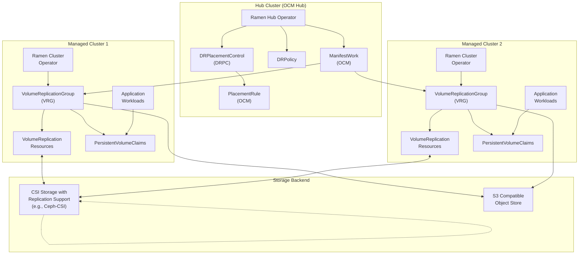

<!--
SPDX-FileCopyrightText: The RamenDR authors
SPDX-License-Identifier: Apache-2.0
-->

# Ramen - Cloud-Native Disaster Recovery for Kubernetes

[](https://opensource.org/licenses/Apache-2.0)
[](https://goreportcard.com/report/github.com/ramendr/ramen)

Ramen is an [Open Cluster Management (OCM)](https://open-cluster-management.io/concepts/architecture/) extension that provides **disaster recovery (DR) and workload relocation services** for Kubernetes applications and their persistent data across multiple managed clusters.

## ✨ Key Features

- **🔄 Planned Workload Migration**: Relocate applications between clusters for maintenance, optimization, or compliance
- **🚨 Disaster Recovery**: Automatic failover to peer clusters during unplanned outages
- **💾 Persistent Data Protection**: Comprehensive PVC and volume replication management
- **🏗️ Cloud-Native Architecture**: Built using Kubernetes operators and custom resources
- **🌐 Multi-Cluster Orchestration**: Seamless integration with OCM for cluster lifecycle management
- **📦 Storage Agnostic**: Works with any CSI storage provider supporting volume replication
- **🔐 Metadata Backup**: Automatic PV cluster state preservation in S3-compatible storage

## 🏛️ Architecture Overview

Ramen follows a **two-tier operator architecture** that integrates with Open Cluster Management:



### Components

- **🎯 Ramen Hub Operator**: Deployed on OCM hub cluster, manages DR policies and orchestrates workload placement
- **⚙️ Ramen Cluster Operator**: Deployed on managed clusters, handles volume replication and local DR operations
- **📋 Custom Resources**: DRPolicy, DRPlacementControl, VolumeReplicationGroup for declarative DR management

## 🚀 Use Cases

### Regional Disaster Recovery (Regional-DR)
- **Scenario**: Clusters in different geographic regions (US East vs US West)
- **Replication**: Asynchronous storage replication
- **Protection**: Regional outages, natural disasters, data center failures

### Metro Disaster Recovery (Metro-DR)
- **Scenario**: Clusters in the same metro area with high-speed connections
- **Replication**: Synchronous storage replication
- **Protection**: Individual cluster failures with zero data loss

### Planned Migration
- **Use Case**: Controlled workload movement for maintenance or optimization
- **Operation**: `Relocate` action for seamless migration

### Emergency Failover
- **Use Case**: Business continuity during unexpected outages
- **Operation**: `Failover` action for rapid recovery

## 🔧 Prerequisites

### Infrastructure Requirements
- **OCM Hub Cluster**: Open Cluster Management hub for orchestration
- **Managed Clusters**: OCM managed clusters with CSI volume replication support
- **Storage Backend**: CSI storage provider supporting [volume replication extensions](https://github.com/csi-addons/spec)
- **Object Storage**: S3-compatible store for metadata backup
- **Kubernetes**: Version 1.20 or higher

### Supported Storage Providers
- **Primary**: [Ceph-CSI](https://github.com/ceph/ceph-csi/) (RBD and CephFS)
- **Integration**: VolSync for snapshot-based replication
- **Requirements**: CSI Volume Replication extensions

### Tool Requirements
- `kubectl` > v1.21
- [Operator Lifecycle Manager (OLM)](https://olm.operatorframework.io/)
- Access to [Ramen operator catalog](https://quay.io/repository/ramendr/ramen-operator-catalog)

## 📦 Installation

### Quick Install (OLM)

**Install Ramen Hub Operator:**
```bash
kubectl apply -k github.com/RamenDR/ramen/config/olm-install/hub/?ref=main
```

**Install Ramen Cluster Operator (on each managed cluster):**
```bash
kubectl apply -k github.com/RamenDR/ramen/config/olm-install/dr-cluster/?ref=main
```

### Verify Installation
```bash
# Check hub operator
kubectl get deployments -n ramen-system ramen-hub-operator

# Check cluster operator
kubectl get deployments -n ramen-system ramen-dr-cluster-operator
```

## 🎯 Quick Start

### 1. Create a DR Policy
```yaml
apiVersion: ramendr.openshift.io/v1alpha1
kind: DRPolicy
metadata:
  name: my-dr-policy
spec:
  drClusters: ["cluster1", "cluster2"]
  schedulingInterval: "5m"
```

### 2. Create DR Placement Control
```yaml
apiVersion: ramendr.openshift.io/v1alpha1
kind: DRPlacementControl
metadata:
  name: my-app-drpc
spec:
  drPolicyRef:
    name: my-dr-policy
  placementRef:
    name: my-app-placement
  pvcSelector:
    matchLabels:
      app: my-application
```

### 3. Perform DR Operations
```bash
# Failover to secondary cluster
kubectl patch drpc my-app-drpc --type='merge' -p='{"spec":{"action":"Failover","failoverCluster":"cluster2"}}'

# Relocate back to primary
kubectl patch drpc my-app-drpc --type='merge' -p='{"spec":{"action":"Relocate","preferredCluster":"cluster1"}}'
```

## 🧪 Development and Testing

### Development Environment Setup

**Prerequisites:**
- 8+ CPUs, 20+ GiB RAM, 100+ GiB storage
- Linux (tested on Fedora 37/38)
- Docker/Podman, minikube, virtualization support

**Quick Setup:**
```bash
# Clone and set up environment
git clone https://github.com/RamenDR/ramen.git
cd ramen
make venv
source venv

# Start test environment
cd test
drenv start envs/regional-dr.yaml

# Build and deploy
cd ../
make docker-build
ramendev deploy test/envs/regional-dr.yaml
ramendev config test/envs/regional-dr.yaml

# Run basic tests
test/basic-test/run test/envs/regional-dr.yaml
```

### Running Tests
```bash
# Full regional DR test suite
test/basic-test/run test/envs/regional-dr.yaml

# Individual test steps
test/basic-test/deploy test/envs/regional-dr.yaml
test/basic-test/enable-dr test/envs/regional-dr.yaml
test/basic-test/failover test/envs/regional-dr.yaml
```

## 🔗 Technology Stack

| Component | Technology | Purpose |
|-----------|------------|---------|
| **Language** | Go 1.24+ | Core implementation |
| **Framework** | Kubernetes Controller Runtime | Operator framework |
| **Cluster Management** | Open Cluster Management (OCM) | Multi-cluster orchestration |
| **Storage** | CSI Volume Replication | Storage-level replication |
| **Object Storage** | S3 Compatible | Metadata backup/restore |
| **Backup Integration** | Velero | Application backup workflows |
| **Networking** | Submariner | Cross-cluster connectivity |

## 📚 Documentation

| Document | Description |
|----------|-------------|
| [Installation Guide](docs/install.md) | Detailed installation instructions |
| [Configuration Guide](docs/configure.md) | Configuration and setup |
| [Usage Guide](docs/usage.md) | Using Ramen for DR operations |
| [User Quick Start](docs/user-quick-start.md) | Fast-track setup for testing |
| [Developer Guide](docs/devel-quick-start.md) | Development environment setup |
| [API Reference](docs/drpc-crd.md) | Custom resource documentation |

## 🤝 Contributing

We welcome contributions! Please see our [Contributing Guide](CONTRIBUTING.md) for details.

### Development Workflow
1. Fork the repository
2. Create a feature branch
3. Make your changes with proper tests
4. Ensure all linters pass: `make lint`
5. Submit a pull request

### Code Style
- Follow Go formatting standards (`go fmt`, `go vet`)
- Include proper test coverage
- Sign commits with DCO (`git commit -s`)

## 📊 Project Status

- **Status**: 🚧 Active Development
- **API Maturity**: **Alpha** (APIs may change)
- **Kubernetes Support**: 1.20+
- **License**: Apache 2.0

> **⚠️ Alpha Notice**: All APIs are currently alpha and may change in incompatible ways. Recommended for testing environments only.

## 🐛 Issues and Support

- **Bug Reports**: [GitHub Issues](https://github.com/ramendr/ramen/issues)
- **Feature Requests**: [GitHub Issues](https://github.com/ramendr/ramen/issues)
- **Documentation**: [docs/](docs/) directory

## 📄 License

This project is licensed under the [Apache 2.0 License](LICENSES/Apache-2.0.txt).

---

<div align="center">

**Built with ❤️ by the RamenDR community**

[Website](https://ramendr.io) • [Documentation](docs/) • [Contributing](CONTRIBUTING.md) • [Issues](https://github.com/ramendr/ramen/issues)

</div>