<!--
SPDX-FileCopyrightText: The RamenDR authors
SPDX-License-Identifier: Apache-2.0
-->

# RamenDR Architecture & Developer Guide

## 🏗️ **RamenDR Operator Architecture**

RamenDR follows a **two-tier operator architecture** that integrates with [Open Cluster Management (OCM)](https://open-cluster-management.io/):

```mermaid
graph TB
    subgraph "Hub Cluster (OCM Hub)"
        RamenHub["🎯 Ramen Hub Operator"]
        OCMHub["OCM Hub"]
        DRPolicy["DRPolicy"]
        DRPC["DRPlacementControl"]
        RamenHub --> DRPolicy
        RamenHub --> DRPC
    end
    
    subgraph "DR Cluster 1"
        RamenDR1["🤖 Ramen DR Operator"]
        VRG1["VolumeReplicationGroup"]
        VolSync1["VolSync"]
        CSI1["CSI Driver"]
        RamenDR1 --> VRG1
        VRG1 --> VolSync1
        VRG1 --> CSI1
    end
    
    subgraph "DR Cluster 2"  
        RamenDR2["🤖 Ramen DR Operator"]
        VRG2["VolumeReplicationGroup"]
        VolSync2["VolSync"]
        CSI2["CSI Driver"]
        RamenDR2 --> VRG2
        VRG2 --> VolSync2
        VRG2 --> CSI2
    end
    
    subgraph "S3 Storage"
        S3["📦 Metadata Backup"]
        MinIO["MinIO (Demo)"]
        AWS["AWS S3 (Production)"]
    end
    
    RamenHub -.->|"Orchestrates"| RamenDR1
    RamenHub -.->|"Orchestrates"| RamenDR2
    VRG1 -.->|"Backup Metadata"| S3
    VRG2 -.->|"Backup Metadata"| S3
    VolSync1 -.->|"Replicate Data"| VolSync2
```



## 🔧 **Key Components**

### **Hub Operator** (`ramen-hub-operator`)
- **Location**: Hub cluster (OCM management cluster)
- **Purpose**: Orchestrates disaster recovery across managed clusters
- **Responsibilities**:
  - Manages `DRPolicy` and `DRPlacementControl` resources
  - Coordinates workload placement and failover
  - Monitors cluster health and triggers DR actions

**Code Location**: [`internal/controller/`](../internal/controller/)
- Hub Controller: [`drplacementcontrol_controller.go`](../internal/controller/drplacementcontrol_controller.go)
- DRPolicy Controller: [`drpolicy_controller.go`](../internal/controller/drpolicy_controller.go)

### **DR Cluster Operator** (`ramen-dr-cluster-operator`)  
- **Location**: Each managed cluster (DR sites)
- **Purpose**: Manages local disaster recovery operations
- **Responsibilities**:
  - Creates and manages `VolumeReplicationGroup` (VRG) resources
  - Handles PVC protection and metadata backup
  - Coordinates with storage replication (VolSync, CSI)

**Code Location**: [`internal/controller/`](../internal/controller/)
- VRG Controller: [`volumereplicationgroup_controller.go`](../internal/controller/volumereplicationgroup_controller.go)
- DRCluster Controller: [`drcluster_controller.go`](../internal/controller/drcluster_controller.go)

## 📋 **Custom Resource Definitions (CRDs)**

### **Core CRDs**
RamenDR defines several custom resources that extend Kubernetes:

#### **1. 📦 VolumeReplicationGroup (VRG)** - Application Volume Protection

**Purpose**: The core resource that manages volume replication for applications. It selects PVCs, handles replication state (primary/secondary), and backs up Kubernetes metadata to S3.

**File**: [`api/v1alpha1/volumereplicationgroup_types.go`](../api/v1alpha1/volumereplicationgroup_types.go)

**Demo YAML Example**:
```yaml
---
# Primary VRG (Active cluster) - examples/test-application/nginx-vrg-correct.yaml
apiVersion: ramendr.openshift.io/v1alpha1
kind: VolumeReplicationGroup
metadata:
  name: nginx-test-vrg
  namespace: nginx-test
  labels:
    app: nginx-test
    ramendr.openshift.io/demo: "true"
spec:
  # Required: PVC selector to identify which PVCs to protect
  pvcSelector:
    matchLabels:
      app: nginx-test

  # Required: Replication state (primary = active, secondary = standby)
  replicationState: primary

  # Required: S3 profiles for metadata storage
  s3Profiles:
  - minio-s3

  # Optional: Action for DR operations
  action: Relocate

  # Optional: Async replication configuration
  async:
    # Required for async: scheduling interval for replication
    schedulingInterval: 5m

    # Volume replication class selector
    replicationClassSelector:
      matchLabels:
        ramendr.openshift.io/replicationID: ramen-volsync

    # Volume snapshot class selector (for point-in-time backups)
    volumeSnapshotClassSelector:
      matchLabels:
        velero.io/csi-volumesnapshot-class: "true"

  # Optional: Kubernetes object protection (in addition to PVCs)
  kubeObjectProtection:
    # Capture interval for Kubernetes metadata
    captureInterval: 10m

    # Select all objects in the namespace for protection
    kubeObjectSelector:
      matchLabels:
        app: nginx-test
```

#### **2. 🏛️ DRPolicy** - Disaster Recovery Policy

**Purpose**: Defines the disaster recovery policy that governs replication between clusters. Specifies which clusters participate in DR, replication intervals, and storage class selectors.

**🔍 Key Discovery**: DRPolicy can **automatically create VolumeReplicationGroups (VRGs)** when:
- A DRPolicy exists with proper cluster and storage class selectors
- Applications with matching PVCs are detected
- No explicit VRG already exists for the application
- This works in both OpenShift ACM and lightweight Kubernetes environments

**File**: [`api/v1alpha1/drpolicy_types.go`](../api/v1alpha1/drpolicy_types.go)

**Demo YAML Example**:
```yaml
---
# examples/dr-policy/drpolicy.yaml
apiVersion: ramendr.openshift.io/v1alpha1
kind: DRPolicy
metadata:
  name: ramen-dr-policy
  namespace: ramen-system
  labels:
    app.kubernetes.io/name: ramen
    app.kubernetes.io/component: dr-policy
spec:
  # List of participating DR clusters (exactly 2 required)
  drClusters:
  - ramen-dr1
  - ramen-dr2

  # Replication class selector
  # Selects VolumeReplicationClass resources for this policy
  replicationClassSelector:
    matchLabels:
      ramendr.openshift.io/replicationID: ramen-volsync

  # Scheduling interval for periodic operations (required)
  schedulingInterval: 5m

  # Optional: Policy-specific configurations
  # asyncSchedulingInterval: 60m
  # syncSchedulingInterval: 5m
```

#### **3. 🎯 DRPlacementControl (DRPC)** - Application Placement Management

**Purpose**: Manages application placement and automatically creates VRGs in **OpenShift ACM environments**. 

**Note**: In lightweight Kubernetes (kind/minikube), VRGs can be created either:
1. **Automatically** by DRPolicy (when matching applications are detected)
2. **Manually** by creating VRG resources directly

**File**: [`api/v1alpha1/drplacementcontrol_types.go`](../api/v1alpha1/drplacementcontrol_types.go)

**Demo YAML Example**:
```yaml
---
# examples/test-application/nginx-drpc.yaml (OpenShift ACM only)
apiVersion: ramendr.openshift.io/v1alpha1
kind: DRPlacementControl
metadata:
  name: nginx-test-drpc
  namespace: nginx-test
  labels:
    app: nginx-test
spec:
  # Reference to the DRPolicy we created
  drPolicyRef:
    name: ramen-dr-policy
    namespace: ramen-system

  # Which cluster should be primary (where app runs)
  preferredCluster: ramen-dr1

  # Which cluster to failover to
  failoverCluster: ramen-dr2

  # PVC selector - which PVCs to protect
  pvcSelector:
    matchLabels:
      app: nginx-test

  # Protection mode
  replicationState: primary
```

#### **4. 🌐 DRCluster** - Cluster Registration

**Purpose**: Registers clusters in the disaster recovery configuration. Links clusters to S3 profiles for metadata storage and defines regional information.

**File**: [`api/v1alpha1/drcluster_types.go`](../api/v1alpha1/drcluster_types.go)

**Demo YAML Example**:
```yaml
---
# examples/dr-policy/drclusters.yaml
apiVersion: ramendr.openshift.io/v1alpha1
kind: DRCluster
metadata:
  name: ramen-dr1
  namespace: ramen-system
  labels:
    app.kubernetes.io/name: ramen
    app.kubernetes.io/component: dr-cluster
    cluster.ramendr.openshift.io/name: dr1
spec:
  # S3 configuration for metadata storage
  s3ProfileName: minio-s3

  # Region/Zone identification
  region: us-east-1

---
apiVersion: ramendr.openshift.io/v1alpha1
kind: DRCluster
metadata:
  name: ramen-dr2
  namespace: ramen-system
  labels:
    app.kubernetes.io/name: ramen
    app.kubernetes.io/component: dr-cluster
    cluster.ramendr.openshift.io/name: dr2
spec:
  # S3 configuration for metadata storage
  s3ProfileName: minio-s3

  # Region/Zone identification (different from dr1)
  region: us-east-2
```

#### **5. ⚙️ RamenConfig** - S3 Backend Configuration

**Purpose**: Configures S3 storage profiles for metadata backup, controller settings, and operator behavior. Deployed as a ConfigMap containing YAML configuration.

**File**: [`api/v1alpha1/ramenconfig_types.go`](../api/v1alpha1/ramenconfig_types.go)

**Demo YAML Example**:
```yaml
---
# examples/s3-config/ramenconfig.yaml
apiVersion: v1
kind: ConfigMap
metadata:
  name: ramen-dr-cluster-config
  namespace: ramen-system
  labels:
    app.kubernetes.io/name: ramen
    app.kubernetes.io/component: config
data:
  ramen_manager_config.yaml: |
    # RamenDR Manager Configuration
    ramenControllerType: dr-cluster
    maxConcurrentReconciles: 1
    drClusterOperator:
      deploymentAutomationEnabled: true
      s3StoreProfiles:
      - s3ProfileName: minio-s3
        s3Bucket: ramen-metadata
        s3Region: us-east-1
        s3CompatibleEndpoint: http://minio.minio-system.svc.cluster.local:9000
        s3SecretRef:
          name: ramen-s3-secret
          namespace: ramen-system

---
# Hub operator config (if needed)
apiVersion: v1
kind: ConfigMap
metadata:
  name: ramen-hub-operator-config
  namespace: ramen-system
  labels:
    app.kubernetes.io/name: ramen
    app.kubernetes.io/component: config
data:
  ramen_manager_config.yaml: |
    # RamenDR Hub Manager Configuration
    ramenControllerType: dr-hub
    maxConcurrentReconciles: 1
    drClusterOperator:
      deploymentAutomationEnabled: true
      s3StoreProfiles:
      - s3ProfileName: minio-s3
        s3Bucket: ramen-metadata
        s3Region: us-east-1
        s3CompatibleEndpoint: http://minio.minio-system.svc.cluster.local:9000
        s3SecretRef:
          name: ramen-s3-secret
          namespace: ramen-system
```

### **Supporting CRDs**

#### **6. 🔧 DRClusterConfig** - Cluster-Specific Configuration

**Purpose**: Provides cluster-specific configuration for DR operations, including storage classes and cluster capabilities.

**File**: [`config/crd/bases/ramendr.openshift.io_drclusterconfigs.yaml`](../config/crd/bases/ramendr.openshift.io_drclusterconfigs.yaml)

#### **7. 📊 Additional Operational CRDs**

RamenDR also defines several operational CRDs for advanced features:

- **ReplicationGroupSource**: Manages replication source endpoints
- **ReplicationGroupDestination**: Manages replication destination endpoints  
- **ProtectedVolumeReplicationGroupList**: Tracks protected volume groups
- **MaintenanceMode**: Controls maintenance operations

**Location**: [`config/crd/bases/`](../config/crd/bases/)

### **🎯 Demo Workflow - CRD Usage Summary**

| **CRD** | **Required for Demo** | **Created When** | **Purpose in Demo** |
|---------|---------------------|------------------|-------------------|
| **RamenConfig** | ✅ Yes | Setup | Configure S3 for metadata storage |
| **DRCluster** | ✅ Yes | Setup | Register hub and DR clusters |
| **DRPolicy** | ✅ Yes | Setup | Define replication policy |
| **VolumeReplicationGroup** | ✅ Yes | Application deployment | Protect application volumes |
| **DRPlacementControl** | ❌ No (kind demo) | N/A | Only for OpenShift ACM |

**Demo Flow**:
1. **Setup**: Create `RamenConfig` → `DRCluster` → `DRPolicy`
2. **App Protection**: Deploy app → Create `VolumeReplicationGroup`
3. **Disaster Recovery**: Failover by switching VRG `replicationState`

## 🔗 **Controller Logic**

### **🔗 Object Relationship & Automatic Creation**

**Based on demo findings and troubleshooting:**

```mermaid
graph TD
    DRPolicy["🏛️ DRPolicy"] --> |"Auto-detects PVCs"| VRG["📦 VRG"]
    DRPC["🎯 DRPC"] --> |"Creates (ACM only)"| VRG
    VRG --> |"Protects"| PVC["💾 PVC"]
    VRG --> |"Creates"| VR["🔄 VolumeReplication"]
    VRG --> |"Manages"| ReplicationSource["📤 ReplicationSource"]
    VRG --> |"Manages"| ReplicationDestination["📥 ReplicationDestination"]
    VRG --> |"Backup to"| S3["☁️ S3 Storage"]
    
    style DRPolicy fill:#4ecdc4
    style VRG fill:#45b7d1
    style PVC fill:#96ceb4
```



#### **Automatic VRG Creation Triggers:**
1. **DRPolicy Method**: When DRPolicy detects applications with PVCs matching its selectors
2. **DRPC Method**: When DRPC explicitly manages application placement (ACM environments)
3. **Manual Method**: Direct creation of VRG resources (always works)

### **VRG Controller Workflow**
**File**: [`internal/controller/volumereplicationgroup_controller.go`](../internal/controller/volumereplicationgroup_controller.go)

```go
// Reconcile handles VRG reconciliation
func (r *VolumeReplicationGroupReconciler) Reconcile(ctx context.Context, req ctrl.Request) (ctrl.Result, error) {
    vrg := &ramendrv1alpha1.VolumeReplicationGroup{}
    if err := r.Get(ctx, req.NamespacedName, vrg); err != nil {
        return ctrl.Result{}, client.IgnoreNotFound(err)
    }

    // Main reconciliation logic
    switch vrg.Spec.ReplicationState {
    case ramendrv1alpha1.Primary:
        return r.reconcilePrimary(ctx, vrg)
    case ramendrv1alpha1.Secondary:
        return r.reconcileSecondary(ctx, vrg)
    default:
        return r.reconcileUnknown(ctx, vrg)
    }
}

// reconcilePrimary handles primary workload protection
func (r *VolumeReplicationGroupReconciler) reconcilePrimary(ctx context.Context, vrg *ramendrv1alpha1.VolumeReplicationGroup) (ctrl.Result, error) {
    // 1. Discover and protect PVCs matching selector
    pvcs, err := r.selectPVCs(ctx, vrg)
    if err != nil {
        return ctrl.Result{}, err
    }

    // 2. Create VolumeReplication resources for each PVC
    for _, pvc := range pvcs {
        if err := r.ensureVolumeReplication(ctx, vrg, pvc); err != nil {
            return ctrl.Result{}, err
        }
    }

    // 3. Backup Kubernetes object metadata to S3
    if err := r.backupKubeObjects(ctx, vrg); err != nil {
        return ctrl.Result{}, err
    }

    // 4. Update VRG status
    return r.updateVRGStatus(ctx, vrg)
}
```

### **S3 Backup Implementation**
**File**: [`internal/controller/kubeobjects.go`](../internal/controller/kubeobjects.go)

```go
// S3ObjectStore interface for metadata backup
type S3ObjectStore interface {
    Put(objectName string, data []byte) error
    Get(objectName string) ([]byte, error)
    Delete(objectName string) error
    List(prefix string) ([]string, error)
}

// backupKubeObjects saves Kubernetes manifests to S3
func (r *VolumeReplicationGroupReconciler) backupKubeObjects(ctx context.Context, vrg *ramendrv1alpha1.VolumeReplicationGroup) error {
    // 1. Collect Kubernetes objects matching kubeObjectSelector
    objects, err := r.collectKubeObjects(ctx, vrg)
    if err != nil {
        return err
    }

    // 2. Serialize objects to YAML
    data, err := r.serializeObjects(objects)
    if err != nil {
        return err
    }

    // 3. Upload to S3 using configured profiles
    for _, profile := range vrg.Spec.S3Profiles {
        s3Store, err := r.getS3Store(profile)
        if err != nil {
            return err
        }
        
        objectName := fmt.Sprintf("%s/%s/kubeobjects.yaml", vrg.Namespace, vrg.Name)
        if err := s3Store.Put(objectName, data); err != nil {
            return err
        }
    }

    return nil
}
```

## 🎯 **Webhook Implementation**

### **Admission Webhooks**
**File**: [`internal/controller/webhook/`](../internal/controller/webhook/)

RamenDR uses admission webhooks for validation and mutation:

```go
// VRG Validation Webhook
func (r *VolumeReplicationGroup) ValidateCreate() error {
    // Validate VRG creation
    if err := r.validatePVCSelector(); err != nil {
        return err
    }
    if err := r.validateS3Profiles(); err != nil {
        return err
    }
    return r.validateReplicationState()
}

func (r *VolumeReplicationGroup) ValidateUpdate(old runtime.Object) error {
    // Validate VRG updates
    oldVRG := old.(*VolumeReplicationGroup)
    
    // Prevent changing certain immutable fields
    if !reflect.DeepEqual(r.Spec.PVCSelector, oldVRG.Spec.PVCSelector) {
        return errors.New("pvcSelector is immutable")
    }
    
    return r.ValidateCreate()
}
```
## 💻 **Developer & Codebase Overview**

### **🎯 Core Purpose & Architecture**

RamenDR is a **Kubernetes-native disaster recovery solution** that provides automated failover and failback capabilities for stateful applications across multiple clusters. The system orchestrates disaster recovery through:

- **📦 Volume Replication**: Synchronizing persistent volumes between clusters
- **🗂️ Application Metadata Backup**: Using Velero for Kubernetes objects  
- **🔄 Cross-Cluster Orchestration**: Managing failover/failback workflows
- **📋 Policy-Driven DR**: Declarative disaster recovery policies

### **🏗️ Main Components & Functionality**

#### **1. Core Controllers (`internal/controller/`)**

##### **📦 VolumeReplicationGroup (VRG) Controller**
- **Primary Component**: Orchestrates all DR operations at the cluster level
- **Files**: `volumereplicationgroup_controller.go`, `vrg_*.go`
- **Key Functions**:
  ```go
  // Manages volume replication (CSI, VolSync)
  func (r *VolumeReplicationGroupReconciler) reconcileVolumeReplication()
  
  // Handles application metadata backup/restore via Velero  
  func (r *VolumeReplicationGroupReconciler) reconcileKubeObjects()
  
  // Coordinates recipe execution (pre/post hooks)
  func (r *VolumeReplicationGroupReconciler) reconcileRecipes()
  
  // Maintains replication state (primary/secondary)
  func (r *VolumeReplicationGroupReconciler) updateReplicationState()
  ```

##### **🎯 DRPlacementControl (DRPC) Controller**
- **Hub-Level Orchestrator**: Manages cross-cluster DR workflows
- **File**: `drplacementcontrol_controller.go`
- **Key Functions**:
  ```go
  // Initiates failover/failback operations
  func (r *DRPlacementControlReconciler) handleFailover()
  
  // Manages placement across clusters via OCM
  func (r *DRPlacementControlReconciler) reconcilePlacement()
  
  // Coordinates with Open Cluster Management (OCM)
  func (r *DRPlacementControlReconciler) updateManifestWork()
  
  // Enforces DR policies
  func (r *DRPlacementControlReconciler) validateDRPolicy()
  ```

##### **📋 DRPolicy Controller**
- **Policy Management**: Defines DR configurations and cluster relationships
- **File**: `drpolicy_controller.go`
- **Key Functions**:
  ```go
  // Validates cluster pairs for DR
  func (r *DRPolicyReconciler) validateClusterPairs()
  
  // Configures replication parameters
  func (r *DRPolicyReconciler) setupReplicationClasses()
  
  // Manages S3 storage for metadata backups
  func (r *DRPolicyReconciler) configureS3Storage()
  ```

##### **🌐 DRCluster Controller**
- **Cluster Registration**: Manages cluster enrollment in DR
- **File**: `drcluster_controller.go`  
- **Key Functions**:
  ```go
  // Validates cluster readiness for DR
  func (r *DRClusterReconciler) validateClusterHealth()
  
  // Configures storage classes and snapshot classes
  func (r *DRClusterReconciler) setupStorageClasses()
  
  // Manages cluster-specific DR configurations
  func (r *DRClusterReconciler) configureClusterProfile()
  ```

#### **2. Storage Integration Modules**

##### **🔄 Volume Replication (`vrg_volrep.go`)**
```go
// CSI-based replication using VolumeReplication CRDs
func (v *VRGInstance) reconcileVolumeReplication() {
    // Creates VolumeReplication resources for each PVC
    // Manages primary/secondary relationships
    // Handles replication health monitoring
}
```

##### **🔁 VolSync Integration (`vrg_volsync.go`)**
```go
// Asynchronous replication using VolSync
func (v *VRGInstance) reconcileVolSync() {
    // ReplicationSource (primary cluster)
    // ReplicationDestination (secondary cluster)  
    // Supports Rsync and Rclone methods
}
```

##### **📊 Volume Group Replication (`vrg_volgrouprep.go`)**
```go
// Consistent group replication for multiple volumes
func (v *VRGInstance) reconcileVolumeGroupReplication() {
    // Ensures crash-consistent snapshots across volume groups
    // Manages group-level replication policies
}
```

#### **3. Application Metadata Management**

##### **🗂️ Velero Integration (`kubeobjects/velero/`)**
```go
// Backup/Restore Kubernetes objects
func (m RequestsManager) ProtectRequestCreate() // Creates Velero Backup
func (m RequestsManager) RecoverRequestCreate() // Creates Velero Restore

// Excludes volume-related resources that VRG handles
func getBackupSpecFromObjectsSpec(objectsSpec kubeobjects.Spec) velero.BackupSpec {
    ExcludedResources: []string{
        "PersistentVolumeClaims", 
        "PersistentVolumes",
        "volumereplications.replication.storage.openshift.io",
        // ... other VRG-managed resources
    }
}
```

##### **🔧 Kube Objects Protection (`vrg_kubeobjects.go`)**
```go
// Orchestrates application metadata DR
func (v *VRGInstance) kubeObjectsProtect() // Backup phase
func (v *VRGInstance) kubeObjectsRecover() // Restore phase  
// Integrates with S3 storage for cross-cluster access
```

#### **4. Recipe System (`vrg_recipe.go`)**
```go
// Pre/Post operation hooks for application consistency
func (v *VRGInstance) executeRecipes() {
    // Pre-backup hooks (e.g., database flush, quiesce)
    // Post-restore hooks (e.g., application restart, validation)
    // Supports various hook types (exec, HTTP, etc.)
}
```

### **🔄 Key Workflows**

#### **1. Application Protection (Primary Cluster)**

```mermaid
graph TD
    VRGCreate["📦 VRG Created<br/>replicationState: primary"] 
    --> DiscoverPVCs["🔍 Discover PVCs<br/>via pvcSelector"]
    --> CreateVolRep["🔄 Create VolumeReplication<br/>for each PVC"]
    --> BackupMetadata["🗂️ Backup App Metadata<br/>via Velero to S3"]
    --> ExecuteHooks["⚡ Execute Pre-backup<br/>Recipes/Hooks"]
    --> MonitorHealth["📊 Monitor Replication<br/>Health & Status"]
```


#### **2. Disaster Recovery (Failover)**

```mermaid
graph TD
    TriggerFailover["🚨 DRPC Initiates<br/>Failover to Secondary"] 
    --> PromoteVolumes["⬆️ Promote Volumes<br/>Secondary → Primary"]
    --> RestoreMetadata["📥 Velero Restore<br/>from S3 Backup"]
    --> RecreateObjects["🔧 Recreate Application<br/>Objects & Resources"]
    --> ExecutePostHooks["⚡ Execute Post-restore<br/>Recipes/Hooks"]
    --> AppActive["✅ Application Active<br/>on Secondary Cluster"]
```


#### **3. Failback (Return to Primary)**

```mermaid
graph TD
    InitiateFailback["🔄 Initiate Failback<br/>Process"]
    --> ReverseReplication["↩️ Setup Reverse<br/>Replication"]
    --> SyncData["📊 Sync Data Back<br/>to Original Primary"]
    --> FailoverBack["⬅️ Failover Back<br/>to Original Cluster"] 
    --> ResumeNormal["✅ Resume Normal<br/>Operations"]
```


### **🔌 Integration Points**

#### **🌐 Open Cluster Management (OCM)**
```go
// Multi-cluster orchestration via OCM APIs
type ManifestWork struct {
    // Deploy VRG resources across clusters
}

type ManagedClusterView struct {
    // Read VRG status from remote clusters  
}

type Placement struct {
    // Schedule workloads across clusters based on policies
}
```

#### **📦 Storage Backends**
```go
// Multiple replication methods supported
type VolumeReplication struct {
    // CSI VolumeReplication (vendor-specific)
}

type ReplicationSource struct {
    // VolSync rsync/rclone-based replication
}

type VolumeGroupSnapshot struct {
    // Volume Group Snapshots (consistent groups)
}
```

#### **☁️ S3 Object Storage**
```go
// Metadata backup storage configuration
type S3StoreProfile struct {
    S3ProfileName         string
    S3Bucket             string  
    S3Region             string
    S3CompatibleEndpoint string // MinIO, AWS S3, etc.
    // Cross-cluster access for metadata sharing
    // Encrypted backup storage
}
```

### **⚙️ Configuration & Deployment**

#### **📋 RamenConfig (`api/v1alpha1/ramenconfig_types.go`)**
```yaml
# Global RamenDR configuration
ramenControllerType: dr-hub | dr-cluster | all-in-one
maxConcurrentReconciles: 1
kubeObjectProtection:
  enabled: true
  veleroNamespaceName: velero
drClusterOperator:
  deploymentAutomationEnabled: true
  s3SecretDistributionEnabled: true
  s3StoreProfiles:
  - s3ProfileName: minio-s3
    s3Bucket: ramen-metadata
    s3CompatibleEndpoint: "http://minio.minio-system.svc.cluster.local:9000"
```

#### **🏗️ Deployment Modes**

| **Mode** | **Components** | **Use Case** | **Location** |
|----------|---------------|--------------|---------------|
| **🎯 Hub Cluster** | DRPC, DRPolicy, DRCluster controllers | Multi-cluster orchestration | OCM Hub Cluster |
| **🤖 DR Cluster** | VRG controller, local replication | Local DR operations | Each managed cluster |
| **🔧 All-in-One** | All controllers in single cluster | Testing, development | Single cluster demo |

### **🧪 Testing & Demo Infrastructure**

#### **📁 Demo Environment (`demo/`)**
```bash
# Complete demo setup workflow
./demo/scripts/minikube_setup.sh           # Multi-cluster creation
./demo/scripts/storage/set_ceph_storage.sh  # Rook Ceph setup (production-like)
./demo/scripts/minikube_quick-install.sh    # RamenDR installation
./demo/scripts/setup-test-app-drpc.sh       # Application protection setup
```

#### **✅ Test Suite (`internal/controller/*_test.go`)**
```go
// Comprehensive testing strategy
var _ = Describe("VolumeReplicationGroup Controller", func() {
    // Unit tests for individual controllers
    // Integration tests with fake Kubernetes API (envtest)
    // E2E tests with real clusters (e2e/)
    
    BeforeEach(func() {
        defer GinkgoRecover() // Proper panic handling in test goroutines
    })
})
```

#### **🔧 Test Stability Improvements**
```go
// Recent fix for silent test failures
go func() {
    defer GinkgoRecover() // Captures controller startup panics
    err = k8sManager.Start(ctx)
    Expect(err).ToNot(HaveOccurred())
}()
```

### **📚 Code Navigation Guide**

#### **🎯 Key Entry Points**
- **Main Reconcilers**: [`internal/controller/`](../internal/controller/)
- **API Types**: [`api/v1alpha1/`](../api/v1alpha1/)  
- **Configuration**: [`config/`](../config/)
- **Webhooks**: [`internal/controller/webhook/`](../internal/controller/webhook/)
- **E2E Tests**: [`e2e/`](../e2e/)
- **Demo Scripts**: [`demo/scripts/`](../demo/scripts/)

#### **🔍 Understanding the Flow**
1. **Start with CRDs**: [`api/v1alpha1/`](../api/v1alpha1/) - Understand the data structures
2. **Main Controllers**: [`volumereplicationgroup_controller.go`](../internal/controller/volumereplicationgroup_controller.go) - Core VRG logic
3. **Storage Integration**: [`vrg_volrep.go`](../internal/controller/vrg_volrep.go), [`vrg_volsync.go`](../internal/controller/vrg_volsync.go) - Replication backends
4. **Metadata Handling**: [`vrg_kubeobjects.go`](../internal/controller/vrg_kubeobjects.go) - Velero integration
5. **Demo Examples**: [`demo/yaml/`](../demo/yaml/) - Working configurations

### **🚀 Summary**

RamenDR provides a **complete disaster recovery solution** through:

1. **📦 Automated Volume Replication** (data protection across clusters)
2. **🗂️ Application Metadata Management** (configuration protection via Velero)
3. **🔄 Cross-Cluster Orchestration** (intelligent failover/failback workflows)
4. **📋 Policy-Driven Configuration** (declarative DR management)
5. **🔌 Cloud-Native Integration** (OCM, Velero, CSI, S3 ecosystems)

The codebase follows **cloud-native best practices** with clear separation of concerns, comprehensive testing, and production-ready features for enterprise disaster recovery scenarios.


## 🔌 **Storage Integration**

### **VolSync Integration**
RamenDR integrates with [VolSync](https://volsync.readthedocs.io/) for asynchronous replication:

```yaml
# VolumeReplication CRD (from VolSync)
apiVersion: replication.storage.openshift.io/v1alpha1
kind: VolumeReplication
metadata:
  name: nginx-pvc-repl
  namespace: nginx-test
spec:
  volumeReplicationClass: "ramen-volsync"
  replicationState: "primary"
  dataSource:
    kind: PersistentVolumeClaim
    name: nginx-pvc
```

### **CSI Driver Integration**
RamenDR works with CSI drivers that support volume snapshots:

```yaml
# VolumeSnapshotClass
apiVersion: snapshot.storage.k8s.io/v1
kind: VolumeSnapshotClass
metadata:
  name: csi-hostpath-snapclass
  labels:
    velero.io/csi-volumesnapshot-class: "true"
driver: hostpath.csi.k8s.io
deletionPolicy: Delete
```

## 📚 **Additional Resources**

### **Key Files to Explore**
- **Main Reconcilers**: [`internal/controller/`](../internal/controller/)
- **API Types**: [`api/v1alpha1/`](../api/v1alpha1/)
- **Configuration**: [`config/`](../config/)
- **Webhooks**: [`internal/controller/webhook/`](../internal/controller/webhook/)
- **E2E Tests**: [`test/`](../test/)

### **External Dependencies**
- **Open Cluster Management**: [OCM GitHub](https://github.com/open-cluster-management-io)
- **VolSync**: [VolSync Documentation](https://volsync.readthedocs.io/)
- **Kubernetes CSI**: [CSI Specification](https://kubernetes-csi.github.io/docs/)
- **S3 API**: [AWS S3 Documentation](https://docs.aws.amazon.com/s3/)

### **Development Setup**
See the main project [CONTRIBUTING.md](../CONTRIBUTING.md) for development environment setup and contribution guidelines.

## 🔴 **Red Hat OpenShift Integration**

### **OpenShift Data Foundation (ODF) Integration**

RamenDR is designed to work seamlessly with **Red Hat OpenShift** and **OpenShift Data Foundation (ODF)** to provide enterprise-grade disaster recovery for stateful applications.

#### **What is OpenShift Data Foundation (ODF)?**

**ODF** is Red Hat's comprehensive storage platform that provides:

```mermaid
graph LR
    subgraph "OpenShift Data Foundation (ODF)"
        Ceph["🗄️ Ceph Storage<br/>(Distributed Storage)"]
        NooBaa["☁️ NooBaa<br/>(Object Storage)"] 
        Rook["⚙️ Rook Operator<br/>(Storage Orchestration)"]
        
        Ceph --> BlockStorage["📦 Block Storage<br/>(RBD)"]
        Ceph --> FileStorage["📁 File Storage<br/>(CephFS)"]
        NooBaa --> ObjectStorage["🗂️ Object Storage<br/>(S3-compatible)"]
        Rook --> Ceph
        Rook --> NooBaa
    end
    
    subgraph "OpenShift Applications"
        App1["📱 Stateful App 1<br/>(Database)"]
        App2["📱 Stateful App 2<br/>(CMS)"]
        App3["📱 Stateful App 3<br/>(ML Pipeline)"]
    end
    
    BlockStorage -.-> App1
    FileStorage -.-> App2
    ObjectStorage -.-> App3
```



**ODF Components**:
- **🗄️ Ceph**: Distributed storage backend providing high availability and scalability
- **☁️ NooBaa**: Multi-cloud object storage service with S3-compatible API
- **⚙️ Rook**: Cloud-native storage orchestrator for Ceph and other storage systems

#### **RamenDR + ODF Integration Architecture**

##### **🎯 Hub Cluster Management**

```mermaid
graph TB
    subgraph "OpenShift Hub Cluster"
        direction TB
        ACM["🎯 Advanced Cluster<br/>Management (ACM)"]
        RamenHub["🔴 Ramen Hub<br/>Operator"]
        DRPolicy["📋 DRPolicy<br/>(Replication Rules)"]
        DRPC["🎯 DRPlacementControl<br/>(App Placement)"]
        
        ACM --> RamenHub
        RamenHub --> DRPolicy
        RamenHub --> DRPC
    end
    
    RamenHub -.->|"Orchestrates DR<br/>Across Clusters"| DR1["DR Site 1"]
    RamenHub -.->|"Orchestrates DR<br/>Across Clusters"| DR2["DR Site 2"]
    
    style ACM fill:#ff6b6b
    style RamenHub fill:#ff6b6b
    style DRPolicy fill:#4ecdc4
    style DRPC fill:#4ecdc4
```



##### **🏗️ DR Site Architecture (Each OpenShift Cluster)**

```mermaid
graph TB
    subgraph "OpenShift DR Cluster"
        direction TB
        
        subgraph "Control Plane"
            OCP["🔴 OpenShift<br/>Control Plane"]
            RamenOp["🔴 Ramen DR<br/>Operator"]
            OCP --> RamenOp
        end
        
        subgraph "OpenShift Data Foundation (ODF)"
            direction LR
            Ceph["🗄️ Ceph<br/>Distributed Storage"]
            NooBaa["☁️ NooBaa<br/>Object Storage"]
            Rook["⚙️ Rook<br/>Orchestrator"]
            
            Rook --> Ceph
            Rook --> NooBaa
        end
        
        subgraph "Application Layer"
            VRG["📦 VolumeReplicationGroup<br/>(Volume Protection)"]
            App["📱 Stateful Application<br/>(Database/CMS/etc)"]
            PVC["💾 PVCs<br/>(ODF-backed Storage)"]
            
            App --> PVC
            VRG --> PVC
        end
        
        RamenOp --> VRG
        PVC --> Ceph
    end
    
    style OCP fill:#ff6b6b
    style RamenOp fill:#ff6b6b
    style Ceph fill:#4ecdc4
    style NooBaa fill:#4ecdc4
    style Rook fill:#4ecdc4
    style VRG fill:#45b7d1
    style App fill:#96ceb4
    style PVC fill:#feca57
```



##### **🔄 Cross-Cluster Replication Flow**

```mermaid
graph LR
    subgraph "DR Site 1 (Primary)"
        direction TB
        App1["📱 Active Application"]
        VRG1["📦 VRG (Primary)"]
        Ceph1["🗄️ Ceph Storage"]
        PVC1["💾 PVCs"]
        
        App1 --> PVC1
        VRG1 --> PVC1
        PVC1 --> Ceph1
    end
    
    subgraph "DR Site 2 (Secondary)"
        direction TB
        App2["📱 Standby Application"]
        VRG2["📦 VRG (Secondary)"]
        Ceph2["🗄️ Ceph Storage"]
        PVC2["💾 PVCs"]
        
        App2 -.-> PVC2
        VRG2 --> PVC2
        PVC2 --> Ceph2
    end
    
    subgraph "S3 Metadata Store"
        S3["🗂️ NooBaa/AWS S3<br/>(Kubernetes Metadata)"]
    end
    
    Ceph1 -->|"🔄 RBD Mirroring<br/>(Block Storage)"| Ceph2
    VRG1 -->|"📤 Metadata Backup"| S3
    VRG2 -->|"📤 Metadata Backup"| S3
    
    style App1 fill:#96ceb4
    style App2 fill:#ddd
    style Ceph1 fill:#4ecdc4
    style Ceph2 fill:#4ecdc4
    style S3 fill:#feca57
```



##### **⚡ Disaster Recovery Flow**

```mermaid
graph TD
    Disaster["🔥 Disaster at Site 1"]
    
    subgraph "Automated DR Process"
        Detection["🚨 Hub Detects<br/>Site 1 Failure"]
        Decision["🎯 ACM + Ramen<br/>Decide Failover"]
        Placement["📍 Update Placement<br/>to Site 2"]
        Recovery["🔄 Restore App<br/>from S3 + Storage"]
        Active["✅ App Active<br/>on Site 2"]
        
        Detection --> Decision
        Decision --> Placement
        Placement --> Recovery
        Recovery --> Active
    end
    
    Disaster --> Detection
    
    style Disaster fill:#ff6b6b
    style Detection fill:#feca57
    style Decision fill:#4ecdc4
    style Placement fill:#45b7d1
    style Recovery fill:#96ceb4
    style Active fill:#6c5ce7
```



#### **Integration Benefits**

**🔴 Enterprise OpenShift Features**:
- **Advanced Cluster Management (ACM)**: Centralized multi-cluster management
- **Application Placement**: Intelligent workload placement across clusters  
- **Policy Management**: Centralized DR policy enforcement
- **Observability**: Integrated monitoring and alerting

**📦 ODF Storage Advantages**:
- **Native Replication**: Ceph RBD mirroring for block storage
- **S3 Metadata Storage**: NooBaa provides S3-compatible metadata backend
- **CSI Integration**: Full volume lifecycle management via OpenShift
- **Performance**: High-performance storage optimized for containers

#### **Technical Integration Details**

##### **Storage Classes and CSI Integration**

```yaml
# ODF RBD StorageClass for RamenDR
apiVersion: storage.k8s.io/v1
kind: StorageClass
metadata:
  name: ocs-storagecluster-ceph-rbd
  labels:
    ramendr.openshift.io/replicationID: "rbd-replication"
provisioner: openshift-storage.rbd.csi.ceph.com
parameters:
  clusterID: openshift-storage
  pool: ocs-storagecluster-cephblockpool
  imageFeatures: layering
  csi.storage.k8s.io/provisioner-secret-name: rook-csi-rbd-provisioner
  csi.storage.k8s.io/provisioner-secret-namespace: openshift-storage
  csi.storage.k8s.io/controller-expand-secret-name: rook-csi-rbd-provisioner
  csi.storage.k8s.io/controller-expand-secret-namespace: openshift-storage
  csi.storage.k8s.io/node-stage-secret-name: rook-csi-rbd-node
  csi.storage.k8s.io/node-stage-secret-namespace: openshift-storage
  csi.storage.k8s.io/fstype: ext4
reclaimPolicy: Delete
allowVolumeExpansion: true
volumeBindingMode: Immediate
```

##### **VolumeReplicationClass for ODF**

```yaml
# ODF VolumeReplicationClass
apiVersion: replication.storage.openshift.io/v1alpha1
kind: VolumeReplicationClass
metadata:
  name: rbd-volumereplicationclass
  labels:
    ramendr.openshift.io/replicationID: "rbd-replication"
spec:
  provisioner: openshift-storage.rbd.csi.ceph.com
  parameters:
    mirroringMode: snapshot
    schedulingInterval: "1m"
    replication.storage.openshift.io/replication-secret-name: rook-csi-rbd-provisioner
    replication.storage.openshift.io/replication-secret-namespace: openshift-storage
```

## 📦 **S3 Configuration Reference**

### **Critical Field Names & Structure (From Demo Troubleshooting)**

```yaml
# CORRECT RamenConfig structure
apiVersion: ramendr.openshift.io/v1alpha1
kind: RamenConfig
metadata:
  name: ramen-config
  namespace: ramen-system
# CRITICAL: Array format, not object
s3StoreProfiles:
- s3ProfileName: minio-s3
  s3Bucket: ramen-metadata
  # FIELD NAME IS CRITICAL - found in api/v1alpha1/ramenconfig_types.go:61
  s3CompatibleEndpoint: "http://HOST_IP:9000"  # NOT s3Endpoint!
  s3Region: us-east-1
  s3SecretRef:
    name: ramen-s3-secret
    namespace: ramen-system
```

### **Required Resources on DR Clusters**

1. **S3 Secret** (MUST exist):
```bash
kubectl create secret generic ramen-s3-secret \
  --namespace ramen-system \
  --from-literal=AWS_ACCESS_KEY_ID=minioadmin \
  --from-literal=AWS_SECRET_ACCESS_KEY=minioadmin
```

2. **RamenConfig ConfigMap** (MUST exist):
```bash
kubectl create configmap ramen-dr-cluster-config \
  --namespace ramen-system \
  --from-file=ramen_manager_config.yaml
```

### **S3 Troubleshooting Checklist**

- [ ] ✅ Field name: `s3CompatibleEndpoint` (not `s3Endpoint`)
- [ ] ✅ Array format: `s3StoreProfiles: []` (not `{}`)
- [ ] ✅ Secret exists: `ramen-s3-secret` on DR clusters
- [ ] ✅ ConfigMap exists: `ramen-dr-cluster-config` on DR clusters
- [ ] ✅ Connectivity: DR clusters can reach S3 endpoint
- [ ] ✅ Cross-cluster: MinIO accessible from all clusters

##### **DRPolicy for OpenShift Clusters**

```yaml
# DRPolicy for OpenShift + ODF
apiVersion: ramendr.openshift.io/v1alpha1
kind: DRPolicy
metadata:
  name: odf-dr-policy
  namespace: openshift-operators
spec:
  drClusterSet:
  - name: east-cluster
    region: us-east-1
  - name: west-cluster  
    region: us-west-2
  schedulingInterval: 5m
  replicationClassSelector:
    matchLabels:
      ramendr.openshift.io/replicationID: "rbd-replication"
  volumeSnapshotClassSelector:
    matchLabels:
      velero.io/csi-volumesnapshot-class: "true"
```

#### **Application-Aware Disaster Recovery**

**RamenDR + ODF** provides **application-aware DR** that goes beyond simple storage replication:

1. **📦 Volume Protection**: Automatic protection of ODF-backed PVCs
2. **🗂️ Metadata Backup**: Kubernetes object backup to NooBaa S3 storage
3. **🔄 Orchestrated Failover**: Coordinated application and storage failover
4. **✅ Data Consistency**: Ensures application-consistent recovery points
5. **🎯 Placement Control**: Intelligent placement based on policies and constraints

##### **Example: PostgreSQL DR with ODF**

```yaml
# PostgreSQL application with ODF storage
apiVersion: apps/v1
kind: StatefulSet
metadata:
  name: postgresql
  namespace: database
spec:
  serviceName: postgresql
  replicas: 1
  selector:
    matchLabels:
      app: postgresql
  template:
    metadata:
      labels:
        app: postgresql
    spec:
      containers:
      - name: postgresql
        image: postgres:13
        env:
        - name: POSTGRES_PASSWORD
          value: "secret"
        volumeMounts:
        - name: data
          mountPath: /var/lib/postgresql/data
  volumeClaimTemplates:
  - metadata:
      name: data
      labels:
        app: postgresql  # VRG will select this PVC
    spec:
      accessModes: [ "ReadWriteOnce" ]
      storageClassName: ocs-storagecluster-ceph-rbd  # ODF storage
      resources:
        requests:
          storage: 20Gi

---
# DRPlacementControl for PostgreSQL
apiVersion: ramendr.openshift.io/v1alpha1
kind: DRPlacementControl
metadata:
  name: postgresql-drpc
  namespace: database
spec:
  drPolicyRef:
    name: odf-dr-policy
    namespace: openshift-operators
  preferredCluster: east-cluster
  failoverCluster: west-cluster
  pvcSelector:
    matchLabels:
      app: postgresql
  placementRef:
    kind: Placement
    name: postgresql-placement
    namespace: database
```

#### **OpenShift-Specific Features**

##### **Advanced Cluster Management Integration**

```yaml
# ManagedCluster definition
apiVersion: cluster.open-cluster-management.io/v1
kind: ManagedCluster
metadata:
  name: east-cluster
  labels:
    cluster.open-cluster-management.io/clusterset: dr-clusters
    region: us-east-1
    ramendr.openshift.io/dr-cluster: "true"
spec:
  hubAcceptsClient: true

---
# Placement for application scheduling
apiVersion: cluster.open-cluster-management.io/v1beta1
kind: Placement
metadata:
  name: postgresql-placement
  namespace: database
spec:
  clusterSets:
  - dr-clusters
  predicates:
  - requiredClusterSelector:
      labelSelector:
        matchLabels:
          ramendr.openshift.io/dr-cluster: "true"
```

#### **Deployment on OpenShift**

##### **Using OpenShift OperatorHub**

1. **Install ODF Operator** via OperatorHub
2. **Install RamenDR Operator** via OperatorHub  
3. **Configure ACM** for multi-cluster management
4. **Create DRPolicy** and **DRCluster** resources
5. **Deploy applications** with **DRPlacementControl**

##### **RHACM Console Integration**

RamenDR integrates with the **Red Hat Advanced Cluster Management (RHACM) Console**:

- **📊 Dashboard**: DR status and health monitoring
- **🎯 Application Management**: Application placement and DR configuration
- **📈 Observability**: Metrics and alerts for DR operations
- **🔧 Policy Management**: DR policy creation and management

#### **Production Considerations**

**🔴 Red Hat Support**:
- **Enterprise Support**: Full Red Hat support for OpenShift + ODF + RamenDR
- **Certification**: Certified integration between components
- **Documentation**: Comprehensive Red Hat documentation and best practices
- **Updates**: Coordinated updates and security patches

**📦 Storage Requirements**:
- **ODF Cluster**: Minimum 3 nodes with dedicated storage devices
- **Network Bandwidth**: Sufficient bandwidth for Ceph replication
- **S3 Storage**: NooBaa or external S3 for metadata storage
- **Monitoring**: Integrated with OpenShift monitoring stack

#### **Community & Enterprise**

**🌐 Open Source**: RamenDR is an open-source project with community contributions
**🔴 Red Hat Leadership**: Led by Red Hat with enterprise-grade support
**🤝 Collaboration**: Active collaboration with Kubernetes storage SIG and CNCF projects

This integration delivers **production-ready disaster recovery** for **stateful OpenShift workloads** backed by **enterprise storage (ODF)**.

## 🚀 **Demo Scripts Integration**

The automation scripts in this repository demonstrate how these components work together:

- **`scripts/fresh-demo.sh`**: Complete automated setup
- **`examples/ramendr-demo.sh`**: Interactive demonstration  
- **`examples/monitoring/`**: Status checking and validation tools

These scripts create a working RamenDR environment where you can see all the above components in action! 🎬
