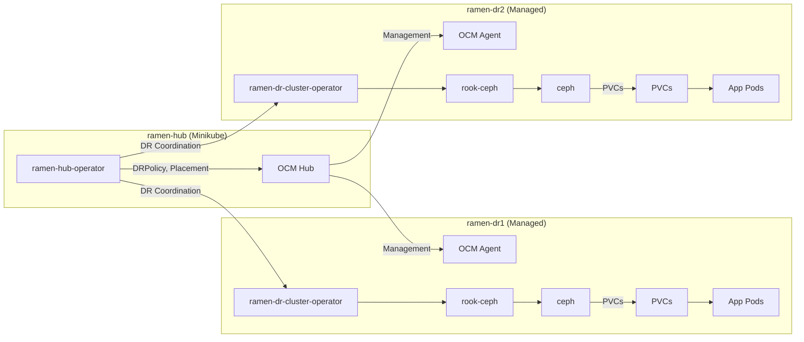

# Rook + Ceph Multi-Cluster Architecture for RamenDR/OCM

This document provides a high-level overview of the topology and architecture for a multi-cluster Kubernetes environment using Rook, Ceph, and RamenDR/OCM for disaster recovery, along with supporting setup scripts.

---

## 1. Rook + Ceph: Multi-Cluster Topology

Below is a diagram showing how Rook and Ceph integrate with Kubernetes clusters to provide shared storage. Each DR cluster runs its own independent Rook-Ceph stack.

```mermaid
flowchart LR
    subgraph Cluster1["ramen-dr1 (Minikube cluster)"]
        direction TB
        k8s1[Kubernetes API]
        rook1[Rook Operator]
        ceph1[Ceph Cluster]
        pvc1[PVCs]
        app1[Workloads\n(Pods)]
        k8s1 --> rook1
        rook1 --> ceph1
        ceph1 -- block/file/object --> pvc1
        pvc1 --> app1
    end

    subgraph Cluster2["ramen-dr2 (Minikube cluster)"]
        direction TB
        k8s2[Kubernetes API]
        rook2[Rook Operator]
        ceph2[Ceph Cluster]
        pvc2[PVCs]
        app2[Workloads\n(Pods)]
        k8s2 --> rook2
        rook2 --> ceph2
        ceph2 -- block/file/object --> pvc2
        pvc2 --> app2
    end

    classDef ceph fill:#E9F7EF,stroke:#229954,stroke-width:2px;
    class ceph1,ceph2 ceph

    %% Optional: S3/Obj endpoints
    ceph1 -.->|Object Gateway (S3)| ob1[S3 Endpoint]
    ceph2 -.->|Object Gateway (S3)| ob2[S3 Endpoint]
```

---

## 2. RamenDR/OCM Multi-Cluster DR Architecture

Here is a diagram showing the OCM (Open Cluster Management) hub, RamenDR, and its relationship to the managed clusters:



---

## 3. Minikube Cluster Creation Script (Reference)

Example snippet (from your [minikube_setup-clusters.sh](https://github.com/nadavleva/my-ramen-playground/blob/b933d61fd3509d3a40d724251a4dc1e6a764e3a0/demo/scripts/minikube_setup-clusters.sh)):

```bash
minikube start \
    --profile="$HUB_PROFILE" \
    --driver="$MINIKUBE_DRIVER" \
    --network="$DOCKER_NETWORK" \
    --memory="$MEMORY" \
    --cpus="$CPUS" \
    --kubernetes-version="$KUBERNETES_VERSION" \
    --addons=storage-provisioner,default-storageclass \
    --wait=true
```

- Repeat for all profiles (ramen-hub, ramen-dr1, ramen-dr2) with the desired resources and network.
- CSI/hostpath and storage-provisioner addons are enabled for storage provisioning.

---

## 4. Additional Notes

- Each DR cluster manages its own Ceph storage. There is no shared backend between clusters; cross-cluster DR is handled by RamenDR and OCM.
- For consistency, use the same storage class names across clusters (e.g., `rook-ceph-block`, `rook-cephfs`, `rook-ceph-bucket`).

---

## 5. References

- [RamenDR Docs](https://ramendr.readthedocs.io/)
- [Rook Docs](https://rook.io/docs/rook/latest/)
- [OCM Docs](https://open-cluster-management.io/)
- [Project Script](https://github.com/nadavleva/my-ramen-playground/blob/main/demo/scripts/minikube_setup-clusters.sh)