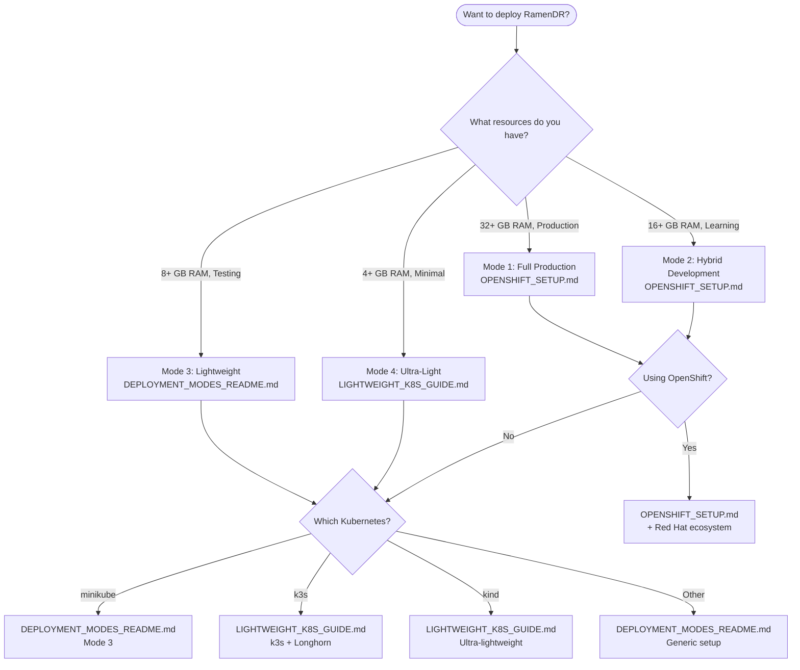

<!--
SPDX-FileCopyrightText: The RamenDR authors
SPDX-License-Identifier: Apache-2.0
-->

# RamenDR Deployment Guide Index

This index helps you choose the right deployment guide based on your needs, resources, and environment.

## 🎯 Quick Decision Tree



## 📚 Available Guides

### 🏗️ [DEPLOYMENT_MODES_README.md](DEPLOYMENT_MODES_README.md)
**Comprehensive guide covering all deployment modes**

| Mode | Platform | Resources | Cost | Best For |
|------|----------|-----------|------|----------|
| Mode 1 | OpenShift Production | 64+ GB RAM | $1000+ | Enterprise, Production |
| Mode 2 | CRC + Cloud OCP | 24+ GB RAM | $400-600 | Development, Learning |
| Mode 3 | minikube/k3s | 12+ GB RAM | Free | Local Development |
| Mode 4 | kind/containers | 6+ GB RAM | Free | Concept Validation |

### 🔴 [OPENSHIFT_SETUP.md](OPENSHIFT_SETUP.md)  
**OpenShift-specific deployment with Red Hat products**

**Covers:**
- CodeReady Containers (CRC) integration
- OpenShift Data Foundation (ODF) setup
- Advanced Cluster Management (ACM) configuration
- Production OpenShift cluster deployment
- Cost optimization strategies

### 🪶 [LIGHTWEIGHT_K8S_GUIDE.md](LIGHTWEIGHT_K8S_GUIDE.md)
**Lightweight Kubernetes distributions for resource-constrained testing**

**Focuses on:**
- k3s + Longhorn (recommended lightweight option)
- Optimized minikube configurations  
- Ultra-lightweight kind setups
- Storage replication simulation
- Minimal resource testing scenarios

### 🎮 [PLAYGROUND_SETUP.md](PLAYGROUND_SETUP.md)
**Complete playground environment for hands-on learning**

**Includes:**
- Detailed system requirements
- Tool installation guides
- Step-by-step environment creation
- Testing scenarios and workflows
- Troubleshooting guides

## 🎯 Choose Your Path

### **I want to learn RamenDR concepts quickly**
→ Start with [LIGHTWEIGHT_K8S_GUIDE.md](LIGHTWEIGHT_K8S_GUIDE.md) - kind setup
- **Time**: 30 minutes
- **Resources**: 4 GB RAM, 4 CPU cores
- **Features**: Basic workflows, simulated storage

### **I want realistic DR testing on a budget**  
→ Use [LIGHTWEIGHT_K8S_GUIDE.md](LIGHTWEIGHT_K8S_GUIDE.md) - k3s + Longhorn
- **Time**: 1 hour
- **Resources**: 6 GB RAM, 6 CPU cores  
- **Features**: Real storage replication, lightweight clusters

### **I want to develop/test applications with DR**
→ Follow [DEPLOYMENT_MODES_README.md](DEPLOYMENT_MODES_README.md) - Mode 3
- **Time**: 2 hours
- **Resources**: 12 GB RAM, 8 CPU cores
- **Features**: Full minikube environment, comprehensive testing

### **I want production-like OpenShift testing**
→ Use [OPENSHIFT_SETUP.md](OPENSHIFT_SETUP.md) - Hybrid mode
- **Time**: 4 hours  
- **Resources**: CRC local + 2 cloud clusters
- **Features**: Real OpenShift, ODF storage, ACM integration

### **I want enterprise production deployment**
→ Follow [OPENSHIFT_SETUP.md](OPENSHIFT_SETUP.md) - Full production
- **Time**: 1-2 days
- **Resources**: 3 full OpenShift clusters
- **Features**: Complete enterprise setup, cross-region DR

## 🛠️ Quick Setup Commands

### Ultra-Fast (kind)
```bash
# 15-minute setup for concept learning
git clone https://github.com/RamenDR/ramen.git
cd ramen
# Follow LIGHTWEIGHT_K8S_GUIDE.md - kind section
```

### Lightweight (k3s)  
```bash
# 1-hour setup for realistic testing
# Follow LIGHTWEIGHT_K8S_GUIDE.md - k3s section
curl -sfL https://get.k3s.io | sh -
# + Longhorn + Ramen setup
```

### Development (minikube)
```bash
# 2-hour setup for comprehensive development
git clone https://github.com/RamenDR/ramen.git
cd ramen && make venv && source venv
cd test && drenv start envs/regional-dr.yaml
```

### OpenShift (CRC + Cloud)
```bash
# 4-hour setup for OpenShift testing
crc start  # Local hub
# + Deploy 2 OCP clusters on cloud
# Follow OPENSHIFT_SETUP.md
```

## 📊 Feature Comparison Matrix

| Feature | kind | k3s | minikube | CRC+Cloud | Full OCP |
|---------|------|-----|----------|-----------|----------|
| **Setup Time** | 15 min | 1 hour | 2 hours | 4 hours | 1-2 days |
| **RAM Required** | 4 GB | 6 GB | 12 GB | 24 GB | 64+ GB |
| **Real Storage Replication** | ❌ | ✅ | ✅ | ✅ | ✅ |
| **Cross-cluster Networking** | ⚠️ | ⚠️ | ✅ | ✅ | ✅ |
| **Production Similarity** | ❌ | ⚠️ | ⚠️ | ✅ | ✅ |
| **Cost** | Free | Free | Free | $400/mo | $1000+/mo |
| **Learning Value** | Basic | Good | Good | High | Complete |
| **Development Use** | Concepts | Testing | Full Dev | Production | Enterprise |

## 🚀 Getting Started Right Now

**Pick your 5-minute quick start:**

### 1. **Just want to see RamenDR APIs?**
```bash
kubectl apply -f https://raw.githubusercontent.com/RamenDR/ramen/main/config/crd/bases/ramendr.openshift.io_drpolicies.yaml
kubectl explain drpolicy.spec
```

### 2. **Want to run minimal tests?**
```bash
kind create cluster --name hub
kind create cluster --name dr1  
kind create cluster --name dr2
# Then follow LIGHTWEIGHT_K8S_GUIDE.md
```

### 3. **Want realistic storage testing?**
```bash
# Install k3s + Longhorn
curl -sfL https://get.k3s.io | sh -
kubectl apply -f https://raw.githubusercontent.com/longhorn/longhorn/master/deploy/longhorn.yaml
# Then follow LIGHTWEIGHT_K8S_GUIDE.md
```

### 4. **Want full playground environment?**
```bash
git clone https://github.com/RamenDR/ramen.git
cd ramen && make venv && source venv
cd test && drenv start envs/regional-dr.yaml
# Then follow PLAYGROUND_SETUP.md
```

### 5. **Want OpenShift integration?**
```bash
crc start
# Then follow OPENSHIFT_SETUP.md
```

## 📞 Need Help?

### **Common Questions:**

**Q: I have limited resources but want real DR testing**  
A: Use k3s + Longhorn from [LIGHTWEIGHT_K8S_GUIDE.md](LIGHTWEIGHT_K8S_GUIDE.md)

**Q: I want to learn before investing in cloud resources**  
A: Start with kind from [LIGHTWEIGHT_K8S_GUIDE.md](LIGHTWEIGHT_K8S_GUIDE.md), then move to Mode 3

**Q: I need to demo RamenDR to stakeholders**  
A: Use [OPENSHIFT_SETUP.md](OPENSHIFT_SETUP.md) hybrid mode for realistic demos

**Q: I want to contribute to RamenDR development**  
A: Use [PLAYGROUND_SETUP.md](PLAYGROUND_SETUP.md) for the full development environment

**Q: Which guide for production deployment?**  
A: [OPENSHIFT_SETUP.md](OPENSHIFT_SETUP.md) Mode 1 for enterprise production

### **Troubleshooting:**
- Resource issues → Check lightweight options in [LIGHTWEIGHT_K8S_GUIDE.md](LIGHTWEIGHT_K8S_GUIDE.md)
- OpenShift specific → See [OPENSHIFT_SETUP.md](OPENSHIFT_SETUP.md) troubleshooting section
- General setup → [DEPLOYMENT_MODES_README.md](DEPLOYMENT_MODES_README.md) troubleshooting
- Development → [PLAYGROUND_SETUP.md](PLAYGROUND_SETUP.md) debugging section

---

## 🎯 TL;DR Recommendations

| Your Situation | Recommended Guide | Estimated Time |
|-----------------|-------------------|----------------|
| **Learning concepts** | [LIGHTWEIGHT_K8S_GUIDE.md](LIGHTWEIGHT_K8S_GUIDE.md) | 30 min |
| **Testing applications** | [LIGHTWEIGHT_K8S_GUIDE.md](LIGHTWEIGHT_K8S_GUIDE.md) | 1 hour |
| **Development work** | [PLAYGROUND_SETUP.md](PLAYGROUND_SETUP.md) | 2 hours |
| **OpenShift evaluation** | [OPENSHIFT_SETUP.md](OPENSHIFT_SETUP.md) | 4 hours |
| **Production planning** | [OPENSHIFT_SETUP.md](OPENSHIFT_SETUP.md) | 1-2 days |

Choose the guide that matches your timeline and resource constraints!
## Testing Conditional CI

This commit only changes documentation to test the new conditional workflow system.
## ✅ Conditional CI System Active

The robust conditional workflow system is now active. Future commits that only change:
- `docs/**` files
- `*.md` files  
- `LICENSE` file
- `CODEOWNERS` file

Will automatically skip all test workflows, saving CI resources and preventing 
flaky test failures on documentation-only contributions.

Mixed commits (code + docs) will still run full test suite for safety.

## 🎉 Conditional CI System Now Working

**Bug Fixed**: The conditional workflow system had a variable name mismatch that prevented proper test skipping.

**Status**: ✅ RESOLVED - Documentation-only commits now automatically skip all test workflows.

**Next**: This commit should demonstrate successful test skipping!
