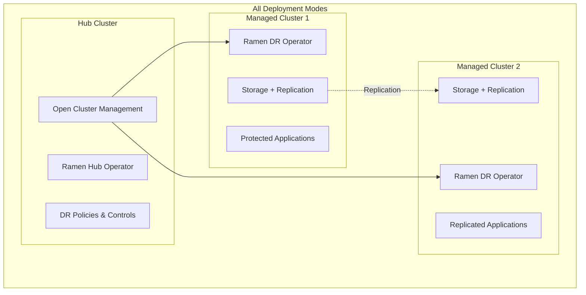

<!--
SPDX-FileCopyrightText: The RamenDR authors
SPDX-License-Identifier: Apache-2.0
-->

# RamenDR Deployment Modes and Lightweight Setup Guide

This comprehensive guide covers all deployment options for RamenDR, from full-featured production setups to lightweight configurations for development and testing.

## 📋 Table of Contents

- [Deployment Overview](#deployment-overview)
- [Mode 1: Full Production Setup](#mode-1-full-production-setup)
- [Mode 2: Hybrid Development Setup](#mode-2-hybrid-development-setup)
- [Mode 3: Lightweight Local Setup](#mode-3-lightweight-local-setup)
- [Mode 4: Ultra-Lightweight Testing](#mode-4-ultra-lightweight-testing)
- [Resource Requirements Matrix](#resource-requirements-matrix)
- [Setup Instructions](#setup-instructions)
- [Troubleshooting](#troubleshooting)

## 🎯 Deployment Overview

RamenDR requires **minimum 3 clusters** for disaster recovery operations:
- **1 Hub Cluster**: OCM orchestration and policy management
- **2 Managed Clusters**: Source and target for DR operations



## 🏗️ Mode 1: Full Production Setup

**Best for**: Production environments, realistic testing, enterprise deployments

### Infrastructure
- **Platform**: OpenShift Container Platform or enterprise Kubernetes
- **Deployment**: Multi-cloud or multi-region clusters
- **Storage**: OpenShift Data Foundation (ODF) or enterprise storage with replication
- **Management**: Red Hat Advanced Cluster Management (RHACM)

### Resource Requirements
```yaml
Hub Cluster:
  CPU: 8 cores
  Memory: 16 GB
  Storage: 100 GB
  Network: High bandwidth, low latency

Managed Clusters (each):
  CPU: 16 cores
  Memory: 32 GB  
  Storage: 500 GB + replication capacity
  Network: Cross-region connectivity
```

### Deployment Architecture
```yaml
# Production deployment example
Hub:
  Platform: OpenShift 4.14+
  Location: Primary datacenter
  Components: [RHACM, Ramen Hub, ArgoCD]
  
DR_Cluster_1:
  Platform: OpenShift 4.14+
  Location: Production region (us-east-1)
  Storage: ODF with async replication
  Components: [Ramen DR, ODF, Velero]
  
DR_Cluster_2:
  Platform: OpenShift 4.14+
  Location: DR region (us-west-2)
  Storage: ODF with async replication
  Components: [Ramen DR, ODF, Velero]
```

### Setup Guide for Mode 1

#### 1. Deploy OpenShift Clusters

```bash
# Using openshift-install for each cluster
# Hub cluster
openshift-install create cluster --dir=hub-cluster

# DR cluster 1 (Production)
openshift-install create cluster --dir=dr1-cluster

# DR cluster 2 (DR site)
openshift-install create cluster --dir=dr2-cluster
```

#### 2. Install Red Hat Advanced Cluster Management

```bash
# On hub cluster
oc apply -f - <<EOF
apiVersion: operators.coreos.com/v1alpha1
kind: Subscription
metadata:
  name: advanced-cluster-management
  namespace: open-cluster-management
spec:
  channel: release-2.10
  installPlanApproval: Automatic
  name: advanced-cluster-management
  source: redhat-operators
  sourceNamespace: openshift-marketplace
EOF
```

#### 3. Install OpenShift Data Foundation

```bash
# On each DR cluster
oc apply -f - <<EOF
apiVersion: operators.coreos.com/v1alpha1
kind: Subscription
metadata:
  name: odf-operator
  namespace: openshift-storage
spec:
  channel: stable-4.14
  installPlanApproval: Automatic
  name: odf-operator
  source: redhat-operators
  sourceNamespace: openshift-marketplace
EOF
```

## 🔄 Mode 2: Hybrid Development Setup

**Best for**: Development, learning, cost-effective testing

### Infrastructure
- **Hub**: CodeReady Containers (CRC) - local
- **Managed Clusters**: 2x small cloud OpenShift clusters
- **Storage**: ODF on cloud clusters, local storage on CRC
- **Cost**: ~$400-600/month

### Resource Requirements
```yaml
Hub (CRC - Local):
  CPU: 4 cores
  Memory: 8 GB
  Storage: 50 GB
  Cost: Free

Managed Clusters (Cloud):
  Instance: m5.xlarge (AWS) or Standard_D4s_v3 (Azure)
  CPU: 4 cores each
  Memory: 16 GB each
  Storage: 100 GB + ODF
  Cost: ~$200-300/month per cluster
```

### Setup Guide for Mode 2

#### 1. Setup CRC Hub

```bash
# Download and install CRC
curl -L https://developers.redhat.com/content-gateway/rest/mirror/pub/openshift-v4/clients/crc/latest/crc-linux-amd64.tar.xz -o crc.tar.xz
tar -xf crc.tar.xz
sudo cp crc-linux-*/crc /usr/local/bin/

# Configure and start
crc setup
crc config set memory 8192
crc config set cpus 4
crc start

# Get credentials
eval $(crc oc-env)
```

#### 2. Deploy Cloud DR Clusters

```bash
# Create lightweight install-config.yaml
cat > dr1-config.yaml <<EOF
apiVersion: v1
baseDomain: example.com
metadata:
  name: dr1
compute:
- name: worker
  replicas: 3
  platform:
    aws:
      type: m5.xlarge
controlPlane:
  name: master
  replicas: 3
  platform:
    aws:
      type: m5.large
platform:
  aws:
    region: us-east-1
EOF

# Install clusters
openshift-install create cluster --dir=dr1 
openshift-install create cluster --dir=dr2  # in us-west-2
```

#### 3. Install Ramen Components

```bash
# On CRC hub
oc apply -k https://github.com/RamenDR/ramen/config/olm-install/hub/?ref=main

# On each DR cluster  
oc apply -k https://github.com/RamenDR/ramen/config/olm-install/dr-cluster/?ref=main
```

## 🪶 Mode 3: Lightweight Local Setup

**Best for**: Resource-constrained development, proof of concepts, CI/CD testing

### Infrastructure
- **Platform**: minikube or k3s clusters
- **Storage**: Longhorn (k3s) or local storage with simulation
- **Management**: Lightweight OCM or simulated multi-cluster
- **Resource**: Reduced requirements for local development

### Resource Requirements
```yaml
Total System Requirements:
  CPU: 8 cores (minimum 6)
  Memory: 12 GB (minimum 8 GB) 
  Storage: 60 GB
  
Per Cluster:
  Hub: 2 CPUs, 2 GB RAM
  DR1: 3 CPUs, 4 GB RAM  
  DR2: 3 CPUs, 4 GB RAM
```

### Setup Guide for Mode 3

#### Option A: Lightweight minikube

```bash
# Create lightweight minikube profiles
minikube start -p hub --cpus=2 --memory=2048 --disk-size=20g
minikube start -p dr1 --cpus=3 --memory=4096 --disk-size=30g  
minikube start -p dr2 --cpus=3 --memory=4096 --disk-size=30g

# Install minimal OCM
kubectl apply -f https://raw.githubusercontent.com/open-cluster-management-io/ocm/main/deploy/cluster-manager/config/samples/operator_deploy_cluster-manager.yaml --context hub

# Install Longhorn for storage replication simulation
kubectl apply -f https://raw.githubusercontent.com/longhorn/longhorn/master/deploy/longhorn.yaml --context dr1
kubectl apply -f https://raw.githubusercontent.com/longhorn/longhorn/master/deploy/longhorn.yaml --context dr2
```

#### Option B: k3s with Longhorn

```bash
# Install k3s clusters
# Hub cluster
curl -sfL https://get.k3s.io | K3S_KUBECONFIG_MODE="644" INSTALL_K3S_EXEC="--cluster-init --node-name hub" sh -

# DR1 cluster  
curl -sfL https://get.k3s.io | K3S_KUBECONFIG_MODE="644" INSTALL_K3S_EXEC="--cluster-init --node-name dr1" sh -

# DR2 cluster
curl -sfL https://get.k3s.io | K3S_KUBECONFIG_MODE="644" INSTALL_K3S_EXEC="--cluster-init --node-name dr2" sh -

# Install Longhorn on DR clusters for storage replication
kubectl apply -f https://raw.githubusercontent.com/longhorn/longhorn/master/deploy/longhorn.yaml --context dr1
kubectl apply -f https://raw.githubusercontent.com/longhorn/longhorn/master/deploy/longhorn.yaml --context dr2
```

#### 3. Minimal Ramen Setup

```bash
# Clone Ramen
git clone https://github.com/RamenDR/ramen.git
cd ramen

# Create lightweight test environment
cat > lightweight-config.yaml <<EOF
name: "lightweight-rdr"
ramen:
  hub: hub
  clusters: [dr1, dr2]
  topology: regional-dr
  features:
    volsync: true
    
templates:
  - name: "light-dr-cluster"
    cpus: 3
    memory: "4g"
    disk_size: "30g"
  - name: "light-hub-cluster"
    cpus: 2
    memory: "2g"
    disk_size: "20g"
EOF

# Deploy using drenv
cd test
drenv start ../lightweight-config.yaml
```

## 🐭 Mode 4: Ultra-Lightweight Testing

**Best for**: Learning RamenDR concepts, minimal resource testing, development laptops

### Infrastructure
- **Platform**: Docker Desktop + kind, or single VM with containers
- **Storage**: Simulated replication with local volumes
- **Management**: Simulated OCM for testing workflows
- **Resource**: Absolute minimum for concept validation

### Resource Requirements
```yaml
Minimum System:
  CPU: 4 cores
  Memory: 6 GB
  Storage: 30 GB
  
Simulated Setup:
  Hub: kind cluster - 1 CPU, 1 GB
  DR1: kind cluster - 1.5 CPU, 2 GB  
  DR2: kind cluster - 1.5 CPU, 2 GB
```

### Setup Guide for Mode 4

#### 1. kind-based Ultra-Light Setup

```bash
# Install kind
curl -Lo ./kind https://kind.sigs.k8s.io/dl/v0.20.0/kind-linux-amd64
chmod +x ./kind
sudo mv ./kind /usr/local/bin/kind

# Create lightweight clusters
cat > hub-config.yaml <<EOF
kind: Cluster
apiVersion: kind.x-k8s.io/v1alpha4
name: hub
nodes:
- role: control-plane
  extraMounts:
  - hostPath: /tmp/hub-storage
    containerPath: /mnt/storage
EOF

cat > dr-config.yaml <<EOF
kind: Cluster  
apiVersion: kind.x-k8s.io/v1alpha4
name: dr1
nodes:
- role: control-plane
  extraMounts:
  - hostPath: /tmp/dr1-storage
    containerPath: /mnt/storage
EOF

# Create clusters
kind create cluster --config hub-config.yaml
kind create cluster --config dr-config.yaml --name dr2

# Install basic storage simulation
kubectl apply -f - <<EOF
apiVersion: v1
kind: StorageClass
metadata:
  name: local-storage
provisioner: kubernetes.io/no-provisioner
volumeBindingMode: WaitForFirstConsumer
EOF
```

#### 2. Ramen Simulation Setup

```bash
# Install minimal OCM components
kubectl apply -f https://raw.githubusercontent.com/open-cluster-management-io/registration-operator/main/deploy/klusterlet/config/samples/operator_deploy_klusterlet.yaml --context kind-dr1
kubectl apply -f https://raw.githubusercontent.com/open-cluster-management-io/registration-operator/main/deploy/klusterlet/config/samples/operator_deploy_klusterlet.yaml --context kind-dr2

# Install Ramen operators (development mode)
cd ramen
make deploy IMG=quay.io/ramendr/ramen-operator:latest
```

## 📊 Resource Requirements Matrix

| Mode | Platform | Total RAM | Total CPU | Storage | Monthly Cost | Best For |
|------|----------|-----------|-----------|---------|--------------|----------|
| **Mode 1** | OpenShift Production | 64+ GB | 32+ cores | 1+ TB | $1000-2000+ | Production, Enterprise |
| **Mode 2** | CRC + Cloud OCP | 24+ GB | 12+ cores | 300+ GB | $400-600 | Development, Learning |
| **Mode 3** | minikube/k3s | 12+ GB | 8+ cores | 60+ GB | $0 | Local Development |
| **Mode 4** | kind/containers | 6+ GB | 4+ cores | 30+ GB | $0 | Concept Validation |

## 🛠️ Setup Instructions by Mode

### Quick Setup Commands

#### Mode 1 (Production)
```bash
# Prerequisites: OpenShift clusters, RHACM subscription
git clone https://github.com/RamenDR/ramen.git
cd ramen
# Follow OpenShift-specific setup in OPENSHIFT_SETUP.md
```

#### Mode 2 (Hybrid)
```bash
# Start CRC hub
crc start

# Deploy cloud clusters with openshift-install
# Install Ramen via OLM on all clusters

# Test with basic workloads
kubectl apply -k samples/
```

#### Mode 3 (Lightweight)
```bash
git clone https://github.com/RamenDR/ramen.git
cd ramen
make venv && source venv

# Create lightweight environment
cd test
drenv start envs/regional-dr.yaml  # with reduced resources
```

#### Mode 4 (Ultra-Light)
```bash
# Install kind and create minimal clusters
kind create cluster --name hub
kind create cluster --name dr1  
kind create cluster --name dr2

# Install minimal Ramen components
kubectl apply -f config/crd/bases/ --context kind-hub
kubectl apply -f config/rbac/ --context kind-hub
```

## 🔍 Lightweight Kubernetes Distributions for RamenDR

### Supported Lightweight Options

#### 1. **k3s** (Recommended for lightweight)
```bash
# Advantages
✅ Resource efficient (minimal overhead)
✅ Built-in storage classes
✅ Easy multi-cluster setup
✅ Longhorn integration for replication

# Setup
curl -sfL https://get.k3s.io | sh -
# Supports storage replication via Longhorn
```

#### 2. **minikube** (Currently used by RamenDR)
```bash
# Advantages  
✅ Officially tested with RamenDR
✅ Good storage driver support
✅ Easy cluster management
✅ Supports CSI drivers

# Setup
minikube start --cpus=2 --memory=4096
# Use with reduced resource configurations
```

#### 3. **kind** (Ultra-lightweight)
```bash
# Advantages
✅ Minimal resource usage
✅ Fast cluster creation
✅ Good for CI/CD testing
✅ Docker-based isolation

# Limitations
❌ Limited storage replication options
❌ Requires storage simulation
❌ Not suitable for realistic DR testing
```

#### 4. **MicroShift** (Red Hat Edge)
```bash
# Advantages
✅ Red Hat supported
✅ Edge/IoT optimized  
✅ OpenShift API compatible
✅ Minimal resource footprint

# Use case: Edge DR scenarios
# Suitable for distributed DR setups
```

### Storage Options for Lightweight Setups

#### Longhorn (Recommended)
```yaml
# Lightweight distributed storage with replication
Features:
  - Built-in replication
  - Snapshot support  
  - Cross-cluster backup
  - Minimal resource overhead
  
Installation:
  kubectl apply -f https://raw.githubusercontent.com/longhorn/longhorn/master/deploy/longhorn.yaml
```

#### Local Storage with Simulation
```yaml
# For development/testing only
Features:
  - Zero overhead
  - Fast setup
  - Simulated replication
  - Good for concept validation
  
Setup:
  - Use hostPath volumes
  - Simulate replication with rsync
  - Manual failover testing
```

## 🧪 Testing Scenarios by Mode

### Mode 1 - Production Testing
- ✅ Real cross-region failover
- ✅ Large-scale applications  
- ✅ Performance testing
- ✅ Network partition scenarios
- ✅ Complete storage replication

### Mode 2 - Development Testing  
- ✅ Application DR workflows
- ✅ Policy configuration
- ✅ Integration testing
- ✅ Cost-effective validation
- ⚠️ Limited cross-region simulation

### Mode 3 - Local Testing
- ✅ Basic DR operations
- ✅ Workflow validation
- ✅ Development iteration
- ⚠️ Simulated networking
- ⚠️ Limited storage replication

### Mode 4 - Concept Testing
- ✅ API validation
- ✅ Basic workflows
- ✅ Quick prototyping
- ❌ No real storage replication
- ❌ Limited to concept validation

## 🐛 Troubleshooting by Mode

### Common Issues and Solutions

#### Mode 1 Issues
```bash
# ODF replication failures
oc exec -n openshift-storage deployment/rook-ceph-tools -- ceph -s

# Cross-region connectivity
oc get managedclusters
oc describe manifestwork -A
```

#### Mode 2 Issues
```bash
# CRC resource constraints
crc config set memory 8192
crc config set cpus 4
crc stop && crc start

# Cloud cluster costs
# Use cluster hibernation features
# Schedule cluster shutdown/startup
```

#### Mode 3 Issues
```bash
# Resource exhaustion
free -h
kubectl top nodes
minikube config set memory 4096 -p dr1

# Storage simulation failures
kubectl get pv,pvc -A
kubectl describe storageclass
```

#### Mode 4 Issues
```bash
# kind cluster networking
kind get kubeconfig --name dr1 > dr1-config
kubectl cluster-info --context kind-dr1

# Storage simulation
kubectl get pods -n local-path-storage
kubectl logs -n local-path-storage deployment/local-path-provisioner
```

## 📚 Additional Resources

- [RamenDR Official Documentation](https://github.com/RamenDR/ramen)
- [Open Cluster Management](https://open-cluster-management.io/)
- [Longhorn Documentation](https://longhorn.io/docs/)
- [k3s Documentation](https://docs.k3s.io/)
- [kind Documentation](https://kind.sigs.k8s.io/)
- [OpenShift Container Platform](https://docs.openshift.com/)

---

## 🎯 Recommendations

**🏆 For Learning**: Start with **Mode 3** (Lightweight Local) using minikube + Longhorn

**🔬 For Development**: Use **Mode 2** (Hybrid) with CRC hub + small cloud clusters  

**🏭 For Production**: Deploy **Mode 1** (Full Production) with enterprise OpenShift

**⚡ For Quick Tests**: Try **Mode 4** (Ultra-Lightweight) with kind for rapid validation

Choose the mode that best fits your resources, goals, and environment constraints!
