<!--
SPDX-FileCopyrightText: The RamenDR authors
SPDX-License-Identifier: Apache-2.0
-->

# kind Networking Limitations for RamenDR

This document details the networking limitations discovered when deploying RamenDR on kind (Kubernetes in Docker) clusters.

## 🔍 Issue Summary

**kind clusters exhibit persistent API server connectivity issues** that affect RamenDR DR cluster operators and VolSync deployment, while the hub operator works correctly.

## 📊 Observed Behavior

### ✅ What Works
- **RamenDR Hub Operator**: Functions perfectly (2/2 Running)
- **Basic Kubernetes operations**: Pod scheduling, service discovery
- **Storage dependencies**: VolumeReplication CRDs, External Snapshotter install successfully
- **Image management**: Docker image building and loading into kind clusters

### ❌ What Fails
- **RamenDR DR Cluster Operators**: CrashLoopBackOff with API server timeouts
- **VolSync deployment**: Fails with identical API server connectivity issues
- **Health/readiness probes**: Timeout due to networking issues

## 🔧 Technical Details

### Error Pattern
```
ERROR: failed to get server groups: Get "https://10.96.0.1:443/api": dial tcp 10.96.0.1:443: i/o timeout
```

### Root Cause Analysis
1. **API Server Endpoint**: `10.96.0.1:443` is the cluster's Kubernetes API server
2. **Timeout Behavior**: Intermittent connectivity to cluster services
3. **Component Specific**: Affects components that make extensive API server calls
4. **Networking Stack**: Issues with containerized node networking in kind

### Why Hub Operator Works but DR Operators Don't
- **Hub Operator**: Simpler API interactions, primarily manages CRDs and basic resources
- **DR Cluster Operators**: Require extensive API discovery for:
  - VolumeReplication resources
  - Storage class enumeration
  - Cross-cluster resource coordination
  - Health probe endpoints

## 🏗️ Architecture Impact

### kind Architecture (Problematic)

```mermaid
graph TB
    subgraph "Docker Host"
        subgraph "kind Cluster"
            subgraph "Control Plane Container"
                API["API Server :6443"]
                ETCD["etcd"]
                SCHED["Scheduler"]
            end
            subgraph "Worker Container(s)"
                KUBELET["kubelet"]
                PODS["Application Pods"]
            end
        end
        
        subgraph "Networking Issues"
            CNI["CNI Plugin"]
            DOCKER_NET["Docker Network"]
            IPTABLES["iptables Rules"]
        end
    end
    
    PODS -.->|"❌ Timeout"| API
    CNI -.->|"🔀 Complex Routing"| DOCKER_NET
    DOCKER_NET -.->|"🐌 Nested NAT"| API
```


### Real Kubernetes (Working)

```mermaid
graph TB
    subgraph "Real Kubernetes Cluster"
        subgraph "Control Plane Node"
            API["API Server :6443"]
            ETCD["etcd"]
            SCHED["Scheduler"]
        end
        subgraph "Worker Node(s)"
            KUBELET["kubelet"]
            PODS["Application Pods"]
        end
        
        subgraph "Native Networking"
            CNI["CNI Plugin"]
            NODE_NET["Node Network"]
            CLUSTER_NET["Cluster Network"]
        end
    end
    
    PODS -->|"✅ Direct"| API
    CNI -->|"🔄 Native"| NODE_NET
    NODE_NET -->|"⚡ Fast"| API
```


## 🔄 Affected Components

### RamenDR DR Cluster Operator Logs
```log
2025-09-01T13:46:59.546Z INFO setup controller/ramenconfig.go:61 loading Ramen configuration
2025-09-01T13:46:59.546Z INFO setup cmd/main.go:107 controller type {"type": "dr-cluster"}
2025-09-01T13:47:29.553Z ERROR setup cmd/main.go:168 unable to index fields for controller {
  "controller": "VolumeReplicationGroup", 
  "error": "failed to get server groups: Get \"https://10.96.0.1:443/api\": dial tcp 10.96.0.1:443: i/o timeout"
}
```

### VolSync Operator Logs
```log
2025-09-01T14:02:15.253Z INFO setup Operator Version: v0.13.0+34b8e30
2025-09-01T14:02:15.253Z INFO setup Registered Movers: [rclone restic rsync rsync-tls syncthing]
2025-09-01T14:02:45.260Z ERROR setup error while looking for SCCs {
  "error": "failed to get server groups: Get \"https://10.96.0.1:443/api\": dial tcp 10.96.0.1:443: i/o timeout"
}
```

## 🎯 Workarounds and Mitigations

### 1. Enhanced Error Handling
Our automation scripts now include:
- Timeout detection and graceful degradation
- CRD availability verification
- Informative error messages about kind limitations

### 2. Partial Functionality
Even with networking issues:
- ✅ CRDs are installed and functional
- ✅ Basic RamenDR API resources can be created
- ✅ Hub operator manages policies correctly

### 3. Alternative Platforms
For stable testing, use:
- **🏆 k3s + Longhorn**: Best lightweight alternative
- **🥈 minikube**: VM-based, more stable networking
- **🥉 Real clusters**: EKS, GKE, AKS for production testing

## 📋 Reproduction Steps

### Environment
- **OS**: Linux (Fedora 42, kernel 6.15.10)
- **Docker**: 28.3.3 Community Edition
- **kind**: Latest version
- **kubectl**: v1.31+

### Setup
```bash
# Create 3 kind clusters
./scripts/setup.sh kind

# Install RamenDR operators
./scripts/setup.sh install
```

### Expected Results
- Hub operator: ✅ 2/2 Running
- DR operators: ❌ 1/2 Running → CrashLoopBackOff
- VolSync: ❌ Deployment timeout

## 🔬 Investigation Commands

```bash
# Check operator status
kubectl get pods -n ramen-system --context kind-ramen-hub
kubectl get pods -n ramen-system --context kind-ramen-dr1  
kubectl get pods -n ramen-system --context kind-ramen-dr2

# Check networking
kubectl get svc kubernetes --context kind-ramen-dr1
kubectl get endpoints kubernetes --context kind-ramen-dr1

# Test API connectivity from within cluster
kubectl run test-pod --image=curlimages/curl --rm -it --restart=Never --context kind-ramen-dr1 -- curl -k https://kubernetes.default.svc.cluster.local/api/v1
```

## 💡 Recommendations

### For Development
1. **Use k3s**: Better networking, lightweight, production-ready
2. **Accept limitations**: kind is suitable for basic concept validation only
3. **Focus on hub operator testing**: Most functionality works

### For Production
1. **Never use kind**: Not designed for production workloads
2. **Real clusters**: AWS EKS, Google GKE, Azure AKS
3. **OpenShift**: Full RamenDR feature support

### For Testing
1. **Hybrid approach**: kind for quick iteration, k3s for integration testing
2. **CI/CD pipelines**: Use real cluster environments
3. **Local development**: minikube or k3s for stable testing

## 🔄 k3s Investigation Results

After discovering kind limitations, we investigated **k3s as an alternative**. Unfortunately, k3s also has **system-level issues** on this environment:

### ❌ **k3s Problems Discovered**
- **RBAC bootstrap failures**: `poststarthook/rbac/bootstrap-roles` consistently fails
- **Priority classes failures**: `poststarthook/scheduling/bootstrap-system-priority-classes` fails  
- **Service restart loops**: k3s keeps restarting due to these bootstrap failures
- **Log spam**: k3s dumps debug logs directly to terminal during startup failures
- **kubectl connectivity**: Works intermittently due to restart loops

### 🔧 **k3s Workarounds Attempted**
```bash
# Log redirection (successful)
curl -sfL https://get.k3s.io | INSTALL_K3S_EXEC="--docker --disable=traefik" sh - >/tmp/k3s-install.log 2>&1

# Log rotation setup (successful)
sudo mkdir -p /var/log/k3s
sudo tee /etc/logrotate.d/k3s > /dev/null << 'EOF'
/var/log/k3s/*.log {
    daily
    rotate 7
    compress
    delaycompress
    missingok
    notifempty
    create 644 root root
    maxsize 100M
}
EOF

# Disabling components (attempted but still fails)
curl -sfL https://get.k3s.io | INSTALL_K3S_EXEC="--docker --disable-network-policy --disable=traefik --write-kubeconfig-mode=644" sh -
```

### 📊 **Platform Comparison Results**
| Platform | Hub Operator | DR Operators | VolSync | Stability | Status |
|----------|--------------|--------------|---------|-----------|---------|
| **kind** | ✅ Perfect (2/2) | ⚠️ Partial (1/2) | ❌ Network issues | 🟡 Moderate | **Working** |
| **k3s** | ❌ Not tested | ❌ Not tested | ❌ Bootstrap failures | 🔴 Poor | **Failed** |

## 📚 References

- [Kubernetes in Docker (kind) Limitations](https://kind.sigs.k8s.io/docs/user/known-issues/)
- [RamenDR Lightweight K8s Guide](./LIGHTWEIGHT_K8S_GUIDE.md)
- [RamenDR Deployment Modes](./DEPLOYMENT_MODES_README.md)
- [VolSync Documentation](https://volsync.readthedocs.io/)

---

**Last Updated**: September 2025  
**Status**: Both kind and k3s have limitations - kind is more stable. Use minikube or real clusters for production testing.
