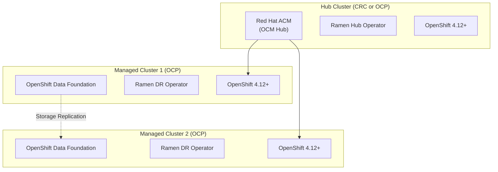

<!--
SPDX-FileCopyrightText: The RamenDR authors
SPDX-License-Identifier: Apache-2.0
-->

# RamenDR with Red Hat OpenShift Setup Guide

This guide provides specific instructions for running RamenDR with Red Hat OpenShift products including CRC, OCP on cloud, and ODF integration.

## 📋 Overview

RamenDR is designed to work natively with OpenShift and integrates with Red Hat's disaster recovery ecosystem including:
- **OpenShift Container Platform (OCP)**
- **OpenShift Data Foundation (ODF)** 
- **Advanced Cluster Management (ACM)**
- **Red Hat CodeReady Containers (CRC)** for development

## 🎯 Architecture Requirements

### **Minimum Multi-Cluster Setup**
RamenDR requires **exactly 3 OpenShift clusters**:



## 🚀 Deployment Options

### **Option 1: Hybrid Setup (Recommended for Development)**

**Components:**
- **Hub**: CRC (local development)
- **DR Clusters**: 2x OCP on AWS/Azure

**Resource Requirements:**
```yaml
Hub Cluster (CRC):
  CPU: 4 cores
  Memory: 8 GB
  Storage: 50 GB
  
DR Clusters (OCP Cloud):
  Instance Type: m5.xlarge (AWS) or Standard_D4s_v3 (Azure)
  Workers: 3 nodes each
  Storage: ODF with 100GB+ per node
```

**Setup Steps:**

#### 1. Setup CRC Hub Cluster

```bash
# Download and install CRC
curl -L https://developers.redhat.com/content-gateway/rest/mirror/pub/openshift-v4/clients/crc/latest/crc-linux-amd64.tar.xz -o crc.tar.xz
tar -xf crc.tar.xz
sudo cp crc-linux-*/crc /usr/local/bin/

# Configure CRC
crc setup
crc config set memory 8192
crc config set cpus 4
crc config set disk-size 50

# Start CRC
crc start

# Get admin credentials
crc console --credentials
eval $(crc oc-env)
```

#### 2. Install Advanced Cluster Management

```bash
# Install ACM operator
oc apply -f - <<EOF
apiVersion: v1
kind: Namespace
metadata:
  name: open-cluster-management
---
apiVersion: operators.coreos.com/v1
kind: OperatorGroup
metadata:
  name: open-cluster-management
  namespace: open-cluster-management
spec:
  targetNamespaces:
  - open-cluster-management
---
apiVersion: operators.coreos.com/v1alpha1
kind: Subscription
metadata:
  name: advanced-cluster-management
  namespace: open-cluster-management
spec:
  channel: release-2.10
  installPlanApproval: Automatic
  name: advanced-cluster-management
  source: redhat-operators
  sourceNamespace: openshift-marketplace
EOF

# Wait for operator installation
oc wait --for=condition=Available --timeout=300s deployment/multiclusterhub-operator -n open-cluster-management

# Create MultiClusterHub
oc apply -f - <<EOF
apiVersion: operator.open-cluster-management.io/v1
kind: MultiClusterHub
metadata:
  name: multiclusterhub
  namespace: open-cluster-management
spec: {}
EOF
```

#### 3. Deploy OpenShift Clusters on Cloud

**AWS Example using openshift-install:**

```bash
# Download openshift-install
curl -L https://mirror.openshift.com/pub/openshift-v4/clients/ocp/stable/openshift-install-linux.tar.gz -o openshift-install.tar.gz
tar -xzf openshift-install.tar.gz
sudo cp openshift-install /usr/local/bin/

# Create install-config.yaml for DR1
cat > dr1-install-config.yaml <<EOF
apiVersion: v1
baseDomain: example.com
metadata:
  name: dr1
platform:
  aws:
    region: us-east-1
compute:
- name: worker
  replicas: 3
  platform:
    aws:
      type: m5.xlarge
controlPlane:
  name: master
  replicas: 3
  platform:
    aws:
      type: m5.xlarge
networking:
  clusterNetwork:
  - cidr: 10.128.0.0/14
    hostPrefix: 23
  networkType: OVNKubernetes
  serviceNetwork:
  - 172.30.0.0/16
pullSecret: '<your-pull-secret>'
sshKey: '<your-ssh-public-key>'
EOF

# Install DR1 cluster
mkdir dr1 && cp dr1-install-config.yaml dr1/install-config.yaml
openshift-install create cluster --dir=dr1

# Repeat for DR2 in different region (us-west-2)
```

#### 4. Install OpenShift Data Foundation

```bash
# On each DR cluster
oc apply -f - <<EOF
apiVersion: v1
kind: Namespace
metadata:
  name: openshift-storage
---
apiVersion: operators.coreos.com/v1
kind: OperatorGroup
metadata:
  name: openshift-storage-operatorgroup
  namespace: openshift-storage
spec:
  targetNamespaces:
  - openshift-storage
---
apiVersion: operators.coreos.com/v1alpha1
kind: Subscription
metadata:
  name: odf-operator
  namespace: openshift-storage
spec:
  channel: stable-4.14
  installPlanApproval: Automatic
  name: odf-operator
  source: redhat-operators
  sourceNamespace: openshift-marketplace
EOF

# Create StorageSystem
oc apply -f - <<EOF
apiVersion: odf.openshift.io/v1alpha1
kind: StorageSystem
metadata:
  name: ocs-storagecluster-storagesystem
  namespace: openshift-storage
spec:
  kind: storagecluster.ocs.openshift.io/v1
  name: ocs-storagecluster
  namespace: openshift-storage
EOF
```

#### 5. Import Clusters to ACM

```bash
# On CRC hub cluster
# Import DR1 cluster
oc apply -f - <<EOF
apiVersion: cluster.open-cluster-management.io/v1
kind: ManagedCluster
metadata:
  name: dr1
spec:
  hubAcceptsClient: true
EOF

# Get import command
oc get secret dr1-import -n dr1 -o jsonpath='{.data.import\.yaml}' | base64 -d > dr1-import.yaml

# On DR1 cluster, apply import
oc apply -f dr1-import.yaml

# Repeat for DR2
```

#### 6. Install Ramen Operators

```bash
# On CRC hub cluster - Install Ramen Hub
oc apply -k https://github.com/RamenDR/ramen/config/olm-install/hub/?ref=main

# On DR clusters - Install Ramen DR Cluster
oc apply -k https://github.com/RamenDR/ramen/config/olm-install/dr-cluster/?ref=main
```

### **Option 2: Full Cloud Deployment**

**Advantages:**
- Production-like environment
- Real cross-region testing
- Better performance

**Components:**
- **Hub**: OCP cluster (smaller instance)
- **DR1**: OCP cluster with ODF (production region)
- **DR2**: OCP cluster with ODF (DR region)

**Setup Process:**
Follow similar steps as Option 1, but deploy all 3 clusters on cloud providers.

### **Option 3: Advanced Local Setup (Expert Level)**

**Multi-CRC with Virtualization:**

```bash
# Setup multiple CRC instances (requires 24+ GB RAM)

# CRC Hub
crc setup
crc config set memory 8192
crc config set cpus 4
crc start

# CRC DR1 (using different profile)
crc setup
crc config set memory 8192  
crc config set cpus 4
crc config set nameserver 8.8.8.8  # Avoid conflicts
crc start --name-server 8.8.8.8

# Note: This requires significant manual networking configuration
# and is not officially supported
```

## 🔧 OpenShift-Specific Configuration

### **Storage Classes for ODF**

```yaml
# Ensure these storage classes exist on DR clusters
apiVersion: storage.k8s.io/v1
kind: StorageClass
metadata:
  name: ocs-storagecluster-ceph-rbd
  labels:
    ramendr.openshift.io/storageID: "ocs-external-storagecluster"
    ramendr.openshift.io/replicationID: "rbd-replication"
provisioner: openshift-storage.rbd.csi.ceph.com
parameters:
  clusterID: openshift-storage
  pool: ocs-storagecluster-cephblockpool
reclaimPolicy: Delete
volumeBindingMode: Immediate
allowVolumeExpansion: true
```

### **Volume Replication Classes**

```yaml
apiVersion: replication.storage.openshift.io/v1alpha1
kind: VolumeReplicationClass
metadata:
  name: rbd-volumereplicationclass
  labels:
    ramendr.openshift.io/replicationID: "rbd-replication"
spec:
  provisioner: openshift-storage.rbd.csi.ceph.com
  parameters:
    mirroringMode: snapshot
    schedulingInterval: "5m"
```

### **DRPolicy Configuration**

```yaml
apiVersion: ramendr.openshift.io/v1alpha1
kind: DRPolicy
metadata:
  name: odf-dr-policy
spec:
  drClusters: ["dr1", "dr2"]
  schedulingInterval: "5m"
  replicationClassSelector:
    matchLabels:
      ramendr.openshift.io/replicationID: "rbd-replication"
  volumeSnapshotClassSelector:
    matchLabels:
      velero.io/csi-volumesnapshot-class: "true"
```

## 🧪 Testing with OpenShift

### **Sample Application Deployment**

```yaml
# Deploy sample application with ODF storage
apiVersion: v1
kind: PersistentVolumeClaim
metadata:
  name: database-pvc
  labels:
    app: database
spec:
  accessModes: ["ReadWriteOnce"]
  resources:
    requests:
      storage: 20Gi
  storageClassName: ocs-storagecluster-ceph-rbd
---
apiVersion: apps/v1
kind: Deployment
metadata:
  name: database
spec:
  replicas: 1
  selector:
    matchLabels:
      app: database
  template:
    metadata:
      labels:
        app: database
    spec:
      containers:
      - name: postgres
        image: postgres:13
        env:
        - name: POSTGRES_PASSWORD
          value: "password"
        volumeMounts:
        - name: data
          mountPath: /var/lib/postgresql/data
      volumes:
      - name: data
        persistentVolumeClaim:
          claimName: database-pvc
```

### **Enable DR Protection**

```yaml
apiVersion: ramendr.openshift.io/v1alpha1
kind: DRPlacementControl
metadata:
  name: database-drpc
spec:
  drPolicyRef:
    name: odf-dr-policy
  placementRef:
    name: database-placement
  pvcSelector:
    matchLabels:
      app: database
  preferredCluster: "dr1"
```

## 🔍 Monitoring and Operations

### **OpenShift Console Integration**

```bash
# Access Ramen resources via OpenShift console
# Navigate to: Administration > CustomResourceDefinitions
# Search for: ramendr.openshift.io

# View DR status
oc get drpc -A
oc get drpolicy -A
oc get vrg -A
```

### **ODF Storage Monitoring**

```bash
# Check ODF replication status
oc get cephcluster -n openshift-storage
oc get cephblockpool -n openshift-storage

# Monitor replication health
oc exec -n openshift-storage deployment/rook-ceph-tools -- ceph -s
oc exec -n openshift-storage deployment/rook-ceph-tools -- rbd mirror pool status
```

## 💰 Cost Considerations

### **Option 1 Costs (Hybrid)**
- **CRC**: Free
- **AWS DR clusters**: ~$200-400/month for development
- **Total**: ~$200-400/month

### **Option 2 Costs (Full Cloud)**
- **3 OCP clusters**: ~$600-1200/month
- **Cross-region data transfer**: Variable
- **Total**: ~$600-1200/month

### **Cost Optimization Tips**
```bash
# Use smaller instance types for development
# Schedule clusters to shut down overnight
# Use spot instances where possible
# Implement cluster hibernation for ACM clusters
```

## 🐛 Troubleshooting OpenShift Issues

### **Common ODF Issues**

```bash
# Check ODF operator status
oc get csv -n openshift-storage

# Verify storage cluster health
oc get storagecluster -n openshift-storage

# Check Ceph cluster status
oc exec -n openshift-storage deployment/rook-ceph-tools -- ceph health detail
```

### **ACM Integration Issues**

```bash
# Check managed cluster status
oc get managedclusters

# Verify cluster import
oc get manifestwork -A

# Debug ACM agent issues
oc logs -n open-cluster-management-agent deployment/klusterlet-work-agent
```

## 📚 Additional Resources

- [Red Hat Advanced Cluster Management Documentation](https://access.redhat.com/documentation/en-us/red_hat_advanced_cluster_management_for_kubernetes/)
- [OpenShift Data Foundation Documentation](https://access.redhat.com/documentation/en-us/red_hat_openshift_data_foundation/)
- [CodeReady Containers Documentation](https://access.redhat.com/documentation/en-us/red_hat_codeready_containers/)
- [RamenDR Official Documentation](https://github.com/RamenDR/ramen)

---

## 🎯 Recommendation

**For learning and development**: Start with **Option 1 (Hybrid Setup)**
- Use CRC for the hub (free, local development)
- Deploy 2 small OCP clusters on AWS for DR testing
- This provides the most cost-effective way to learn RamenDR with real OpenShift

**For production planning**: Use **Option 2 (Full Cloud)** 
- Deploy all clusters in production-like environments
- Test real cross-region scenarios
- Validate actual disaster recovery capabilities

**CRC alone is not sufficient** for RamenDR testing, but it can serve as an excellent hub cluster in a hybrid setup.
