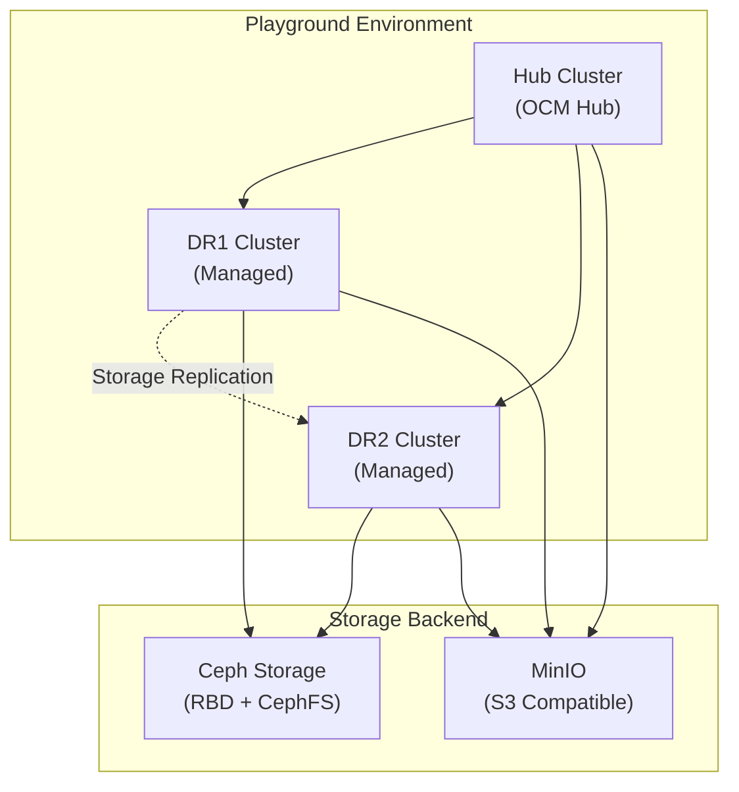

<!--
SPDX-FileCopyrightText: The RamenDR authors
SPDX-License-Identifier: Apache-2.0
-->

# RamenDR Playground Setup Guide

This guide provides step-by-step instructions for setting up a RamenDR playground environment for testing disaster recovery capabilities.

## 📋 Table of Contents

- [System Requirements](#system-requirements)
- [Software Dependencies](#software-dependencies)
- [Environment Setup](#environment-setup)
- [Testing Scenarios](#testing-scenarios)
- [Configuration Options](#configuration-options)
- [Troubleshooting](#troubleshooting)

## 💻 System Requirements

### Hardware Requirements

| Component | Minimum | Recommended |
|-----------|---------|-------------|
| **CPU** | 8 cores | 12+ cores |
| **Memory** | 20 GiB | 32+ GiB |
| **Storage** | 100 GiB | 200+ GiB |
| **Virtualization** | Nested virtualization enabled | Hardware virtualization |

### Platform Requirements

- **Operating System**: Linux (tested on Fedora 37/38, RHEL 8.6+)
- **Architecture**: x86_64 (ARM64 may work but not officially tested)
- **User Privileges**: Non-root user with sudo access
- **Internet**: Stable internet connection for downloading images and tools

### Infrastructure Overview

The playground creates **3 Kubernetes clusters**:
- **1 Hub Cluster**: OCM hub for orchestration (2 CPUs, 4GB RAM)
- **2 Managed Clusters**: DR-enabled clusters (4 CPUs, 6GB RAM each)



## 🔧 Software Dependencies

### Core Tools Installation

#### 1. Virtualization Setup (Fedora/RHEL)

```bash
# Install virtualization packages
sudo dnf install @virtualization

# Enable and start libvirtd
sudo systemctl enable libvirtd --now
sudo systemctl status libvirtd -l

# Add user to libvirt group
sudo usermod -a -G libvirt $(whoami)
# Logout and login for group changes to take effect
```

#### 2. Container Runtime

```bash
# Install Podman (recommended)
sudo dnf install podman

# Verify installation
podman --version
```

#### 3. Kubernetes Tools

```bash
# Install minikube
sudo dnf install https://storage.googleapis.com/minikube/releases/latest/minikube-latest.x86_64.rpm

# Install kubectl
curl -LO "https://dl.k8s.io/release/$(curl -L -s https://dl.k8s.io/release/stable.txt)/bin/linux/amd64/kubectl"
sudo install kubectl /usr/local/bin
rm kubectl

# Verify installations
minikube version
kubectl version --client
```

#### 4. OCM Tools

```bash
# Install clusteradm CLI
curl -L https://raw.githubusercontent.com/open-cluster-management-io/clusteradm/main/install.sh | bash -s 0.11.2

# WARNING: clusteradm 0.11.1 is NOT compatible
```

#### 5. Networking Tools

```bash
# Install Submariner subctl
curl -Ls https://get.submariner.io | bash
sudo install .local/bin/subctl /usr/local/bin/
rm .local/bin/subctl

# Verify version (v0.18.0+ required)
subctl version
```

#### 6. Backup and Storage Tools

```bash
# Install Velero CLI
curl -L -o velero.tar.gz https://github.com/vmware-tanzu/velero/releases/download/v1.14.0/velero-v1.14.0-linux-amd64.tar.gz
tar xf velero.tar.gz --strip 1 velero-v1.14.0-linux-amd64/velero
sudo install velero /usr/local/bin
rm velero.tar.gz velero

# Install MinIO client
curl -L -o mc https://dl.min.io/client/mc/release/linux-amd64/mc
sudo install mc /usr/local/bin
rm mc

# Install kustomize
curl -s "https://raw.githubusercontent.com/kubernetes-sigs/kustomize/master/hack/install_kustomize.sh" | bash
sudo install kustomize /usr/local/bin
rm kustomize
```

#### 7. Additional Tools

```bash
# Install Helm
sudo dnf install helm

# Install Golang (for development)
sudo dnf install golang

# Install ArgoCD CLI (optional)
curl -L -o argocd https://github.com/argoproj/argo-cd/releases/download/v2.11.3/argocd-linux-amd64
sudo install argocd /usr/local/bin/
rm argocd

# Install KubeVirt virtctl (for VM workloads)
curl -L -o virtctl https://github.com/kubevirt/kubevirt/releases/download/v1.5.2/virtctl-v1.5.2-linux-amd64
sudo install virtctl /usr/local/bin
rm virtctl

# Install kubectl-gather plugin (debugging)
tag="$(curl -fsSL https://api.github.com/repos/nirs/kubectl-gather/releases/latest | jq -r .tag_name)"
os="$(uname | tr '[:upper:]' '[:lower:]')"
machine="$(uname -m)"
if [ "$machine" = "aarch64" ]; then machine="arm64"; fi
if [ "$machine" = "x86_64" ]; then machine="amd64"; fi
curl -L -o kubectl-gather https://github.com/nirs/kubectl-gather/releases/download/$tag/kubectl-gather-$tag-$os-$machine
sudo install kubectl-gather /usr/local/bin
rm kubectl-gather
```

### Dependencies Verification

Create a verification script to check all dependencies:

```bash
#!/bin/bash
# Save as verify-deps.sh

echo "🔍 Verifying RamenDR dependencies..."

# Check virtualization
if systemctl is-active --quiet libvirtd; then
    echo "✅ libvirtd is running"
else
    echo "❌ libvirtd is not running"
fi

# Check if user is in libvirt group
if groups $(whoami) | grep -q libvirt; then
    echo "✅ User is in libvirt group"
else
    echo "❌ User not in libvirt group - run: sudo usermod -a -G libvirt $(whoami)"
fi

# Check tools
tools=(
    "minikube:v1.36.0+"
    "kubectl:v1.33.2+"
    "clusteradm:v0.11.2"
    "subctl:v0.18.0+"
    "velero:v1.14.0+"
    "podman:5.5.1+"
    "helm:v3.18.1+"
    "go:go1.24.4+"
)

for tool in "${tools[@]}"; do
    name=$(echo $tool | cut -d: -f1)
    if command -v $name &> /dev/null; then
        version=$($name version 2>/dev/null | head -1)
        echo "✅ $name: $version"
    else
        echo "❌ $name not found"
    fi
done

echo "🎯 Dependencies verification complete!"
```

## 🚀 Environment Setup

### 1. Clone and Setup Ramen

```bash
# Clone the repository
git clone https://github.com/RamenDR/ramen.git
cd ramen

# Create Python virtual environment
make venv

# Activate the environment
source venv

# Verify drenv tool works
test/scripts/drenv-selftest
```

Expected output from `drenv-selftest`:
```
1. Activating the ramen virtual environment ...
2. Creating a test cluster ...
[...cluster creation logs...]
3. Deleting the test cluster ...
[...cleanup logs...]
drenv is set up properly
```

### 2. Start the Regional DR Environment

```bash
# Navigate to test directory
cd test

# Start the 3-cluster environment (takes 10-15 minutes)
drenv start envs/regional-dr.yaml
```

This creates:
- **Hub cluster**: OCM hub with ArgoCD, Submariner
- **DR1 cluster**: Managed cluster with Ceph, Velero, VolSync
- **DR2 cluster**: Managed cluster with Ceph, Velero, VolSync
- **Storage replication**: RBD mirroring between DR1 and DR2
- **Networking**: Submariner for cross-cluster connectivity

### 3. Verify Environment

```bash
# Check minikube profiles
minikube profile list

# Should show:
# | Profile | VM Driver | Runtime    | IP             | Port | Version | Status  | Nodes |
# |---------|-----------|------------|----------------|------|---------|---------|-------|
# | dr1     | kvm2      | containerd | 192.168.122.70 | 8443 | v1.27.4 | Running |   1   |
# | dr2     | kvm2      | containerd | 192.168.122.51 | 8443 | v1.27.4 | Running |   1   |
# | hub     | kvm2      | containerd | 192.168.122.162| 8443 | v1.27.4 | Running |   1   |

# Check cluster status
kubectl get nodes --context hub
kubectl get nodes --context dr1  
kubectl get nodes --context dr2

# Verify OCM managed clusters
kubectl get managedclusters --context hub
```

### 4. Build and Deploy Ramen

```bash
# Build Ramen operator image
cd ../  # Back to ramen root
make docker-build

# Deploy Ramen to the environment
ramendev deploy test/envs/regional-dr.yaml

# Configure Ramen with cluster and S3 settings
ramendev config test/envs/regional-dr.yaml
```

### 5. Setup Sample Applications

```bash
# Deploy sample application channel
kubectl apply -k https://github.com/RamenDR/ocm-ramen-samples.git/channel --context hub

# Verify channel deployment
kubectl get channel,subscription -A --context hub
```

## 🧪 Testing Scenarios

### Basic DR Test Flow

```bash
# Set environment variable
env=$PWD/test/envs/regional-dr.yaml

# Run complete DR test suite
test/basic-test/run $env
```

The basic test performs:
1. **Deploy**: Deploys a busybox application to DR1
2. **Enable DR**: Creates DRPolicy and DRPlacementControl
3. **Failover**: Simulates disaster, fails over to DR2
4. **Relocate**: Planned migration back to DR1
5. **Disable DR**: Removes DR protection
6. **Cleanup**: Uninstalls the application

### Manual Step-by-Step Testing

```bash
# Deploy application
test/basic-test/deploy $env

# Enable DR protection
test/basic-test/enable-dr $env

# Check DR status
kubectl get drpc,drpolicy -A --context hub
kubectl get vrg -A --context dr1
kubectl get vrg -A --context dr2

# Perform failover
test/basic-test/failover $env

# Verify application on DR2
kubectl get pods -A --context dr2

# Relocate back to DR1
test/basic-test/relocate $env

# Cleanup
test/basic-test/undeploy $env
```

### Advanced Testing Scenarios

#### 1. VolSync Testing

```bash
# Test snapshot-based replication
kubectl apply -f - <<EOF
apiVersion: ramendr.openshift.io/v1alpha1
kind: VolumeReplicationGroup
metadata:
  name: volsync-test-vrg
  namespace: busybox-sample
spec:
  pvcSelector:
    matchLabels:
      app: busybox-sample
  replicationState: primary
  s3Profiles: ["minio-on-dr1"]
  volSync:
    disabled: false
    rdSpec:
      - protectedPVC:
          name: busybox-pvc
          namespace: busybox-sample
          protectedByVolSync: true
EOF
```

#### 2. Consistency Group Testing

```bash
# Test multi-volume applications
kubectl apply -f - <<EOF
apiVersion: v1
kind: PersistentVolumeClaim
metadata:
  name: database-data
  namespace: database-app
  labels:
    app: database
    ramendr.openshift.io/consistencyGroup: db-cg
spec:
  accessModes: ["ReadWriteOnce"]
  resources:
    requests:
      storage: 10Gi
  storageClassName: rook-ceph-block
---
apiVersion: v1
kind: PersistentVolumeClaim
metadata:
  name: database-logs
  namespace: database-app
  labels:
    app: database
    ramendr.openshift.io/consistencyGroup: db-cg
spec:
  accessModes: ["ReadWriteOnce"]
  resources:
    requests:
      storage: 5Gi
  storageClassName: rook-ceph-block
EOF
```

## ⚙️ Configuration Options

### Environment Templates

The playground supports multiple environment configurations:

#### Regional DR (Default)
```yaml
# test/envs/regional-dr.yaml
name: "rdr"
ramen:
  hub: hub
  clusters: [dr1, dr2]
  topology: regional-dr
  features:
    volsync: true
```

#### Metro DR
```yaml
# test/envs/metro-dr.yaml (create if needed)
name: "mdr"
ramen:
  hub: hub
  clusters: [metro1, metro2]
  topology: metro-dr
  features:
    volsync: false  # Use sync replication instead
```

#### KubeVirt VM Testing
```yaml
# test/envs/regional-dr-kubevirt.yaml
name: "rdr-vm"
ramen:
  hub: hub
  clusters: [dr1, dr2]
  topology: regional-dr
  features:
    volsync: true
    kubevirt: true
```

### Resource Customization

Modify cluster resources in environment files:

```yaml
templates:
  - name: "dr-cluster"
    cpus: 6          # Increase for larger workloads
    memory: "8g"     # Increase for memory-intensive apps
    disk_size: "100g" # Increase for more storage
    extra_disks: 2   # Add more disks for Ceph
```

### Storage Configuration

#### Ceph Storage Classes
- **rook-ceph-block**: RBD (block storage)
- **rook-ceph-fs**: CephFS (shared filesystem)
- **rook-ceph-block-metro**: Synchronous replication
- **rook-ceph-block-regional**: Asynchronous replication

#### S3 Configuration
MinIO is automatically configured with endpoints:
- **minio-on-dr1**: `https://minio-minio.apps.dr1.example.com`
- **minio-on-dr2**: `https://minio-minio.apps.dr2.example.com`

## 🔍 Monitoring and Debugging

### Useful Commands

```bash
# Check Ramen operator logs
kubectl logs -n ramen-system deployment/ramen-hub-operator --context hub
kubectl logs -n ramen-system deployment/ramen-dr-cluster-operator --context dr1

# Monitor VRG status
kubectl get vrg -A --context dr1 -w
kubectl describe vrg <vrg-name> -n <namespace> --context dr1

# Check storage replication
kubectl get volumereplication -A --context dr1
kubectl get replicationsource,replicationdestination -A --context dr1

# Monitor DRPC status
kubectl get drpc -A --context hub -w
kubectl describe drpc <drpc-name> -n <namespace> --context hub

# Check Ceph status
kubectl exec -n rook-ceph deployment/rook-ceph-tools --context dr1 -- ceph -s
kubectl exec -n rook-ceph deployment/rook-ceph-tools --context dr1 -- rbd mirror pool status

# Debug networking
kubectl get submariner -A --context dr1
subctl show connections --context dr1
```

### Log Collection

```bash
# Collect comprehensive logs
kubectl gather --context hub --context dr1 --context dr2 \
  --resources='pods,deployments,services,pvc,pv,vrg,drpc,drpolicy,volumereplication'

# Specific Ramen logs
kubectl logs -n ramen-system -l app.kubernetes.io/name=ramen --context dr1 \
  --since=1h > ramen-dr1-logs.txt
```

## 🐛 Troubleshooting

### Common Issues

#### 1. Environment Creation Failures

**Symptom**: `drenv start` fails with cluster creation errors

**Solutions**:
```bash
# Check virtualization support
virt-host-validate

# Verify libvirt group membership
groups $(whoami)

# Check available resources
free -h
df -h

# Clean up and retry
drenv delete envs/regional-dr.yaml
drenv start envs/regional-dr.yaml
```

#### 2. Ramen Operator Not Starting

**Symptom**: Ramen pods in CrashLoopBackOff

**Solutions**:
```bash
# Check operator logs
kubectl logs -n ramen-system deployment/ramen-dr-cluster-operator --context dr1

# Verify CRDs are installed
kubectl get crd | grep ramen

# Check S3 connectivity
kubectl run s3-test --image=amazon/aws-cli --rm -it --context dr1 -- \
  s3 ls s3://bucket-name --endpoint-url=https://minio.example.com
```

#### 3. Storage Replication Issues

**Symptom**: VolumeReplication stuck in "Progressing" state

**Solutions**:
```bash
# Check VolumeReplicationClass
kubectl get volumereplicationclass --context dr1

# Verify Ceph replication
kubectl exec -n rook-ceph deployment/rook-ceph-tools --context dr1 -- \
  rbd mirror pool status

# Check CSI driver logs
kubectl logs -n rook-ceph daemonset/csi-rbdplugin --context dr1
```

#### 4. Cross-Cluster Connectivity

**Symptom**: Applications can't failover between clusters

**Solutions**:
```bash
# Check Submariner status
subctl show connections --context dr1

# Verify service exports
kubectl get serviceexport -A --context dr1

# Test cross-cluster networking
subctl verify --context dr1 --tocontext dr2
```

### Performance Tuning

#### Resource Optimization
```bash
# Increase cluster resources if needed
minikube config set memory 8192 -p dr1
minikube config set cpus 6 -p dr1

# Restart cluster with new resources
minikube stop -p dr1
minikube start -p dr1
```

#### Storage Performance
```bash
# Monitor Ceph performance
kubectl exec -n rook-ceph deployment/rook-ceph-tools --context dr1 -- \
  ceph osd perf

# Check replication lag
kubectl get vrg <vrg-name> -o jsonpath='{.status.lastGroupSyncTime}' --context dr1
```

## 🧹 Cleanup

### Partial Cleanup
```bash
# Undeploy Ramen but keep clusters
ramendev unconfig test/envs/regional-dr.yaml
ramendev undeploy test/envs/regional-dr.yaml

# Remove test applications
test/basic-test/undeploy $env
```

### Complete Cleanup
```bash
# Delete entire environment
cd test
drenv delete envs/regional-dr.yaml

# Clean up any leftover processes
minikube delete --all
```

### Reset for Fresh Start
```bash
# Complete reset
drenv delete envs/regional-dr.yaml
make clean
make venv
source venv
drenv start envs/regional-dr.yaml
```

---

## 🎯 Next Steps

After successfully setting up the playground:

1. **Explore Sample Applications**: Try different workload types (databases, web apps, VMs)
2. **Test Advanced Scenarios**: Multi-namespace protection, complex applications
3. **Performance Testing**: Load testing with large datasets
4. **Custom Applications**: Deploy your own applications with DR protection
5. **Contribute**: Report issues, contribute improvements to the project

## 📚 Additional Resources

- [Ramen Documentation](docs/)
- [OCM Documentation](https://open-cluster-management.io/)
- [Submariner Documentation](https://submariner.io/)
- [VolSync Documentation](https://volsync.readthedocs.io/)
- [Ceph Documentation](https://docs.ceph.com/)

---

**Happy Testing!** 🚀

For questions or issues, please open an issue at [RamenDR GitHub](https://github.com/RamenDR/ramen/issues).
