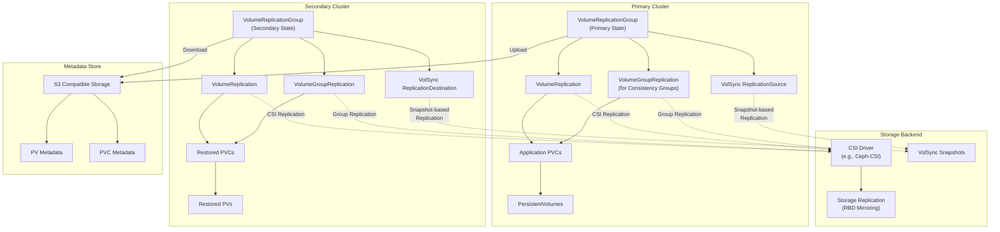
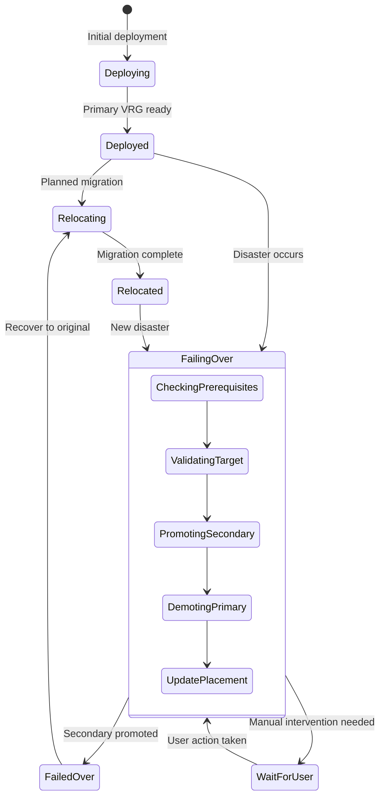

<!--
SPDX-FileCopyrightText: The RamenDR authors
SPDX-License-Identifier: Apache-2.0
-->

# Ramen Storage Replication and Disaster Recovery Architecture

This document provides an in-depth analysis of how Ramen handles storage replication and disaster recovery operations, based on codebase examination and architectural analysis.

## 📋 Table of Contents

- [Overview](#overview)
- [Core Components](#core-components)
- [Replication Technologies](#replication-technologies)
- [Storage Replication Workflows](#storage-replication-workflows)
- [Metadata Management](#metadata-management)
- [State Management and Transitions](#state-management-and-transitions)
- [Advanced Features](#advanced-features)
- [Configuration Examples](#configuration-examples)
- [Troubleshooting](#troubleshooting)

## 🎯 Overview

Ramen implements a sophisticated multi-layer storage replication system that provides enterprise-grade disaster recovery capabilities for Kubernetes applications. The system is designed to:

- **Orchestrate multiple replication technologies** (CSI Volume Replication, VolSync, storage-native)
- **Preserve cluster metadata** for complete application state restoration
- **Manage complex state transitions** during failover and relocate operations
- **Support consistency groups** for applications requiring coordinated snapshots
- **Integrate seamlessly** with Open Cluster Management (OCM) for multi-cluster orchestration

## 🏗️ Core Components

### VolumeReplicationGroup (VRG)

The VRG is the central orchestrator for all storage replication activities:

```yaml
apiVersion: ramendr.openshift.io/v1alpha1
kind: VolumeReplicationGroup
metadata:
  name: my-app-vrg
  namespace: my-app
spec:
  # PVC selection for protection
  pvcSelector:
    matchLabels:
      app: my-application
  
  # Primary or Secondary replication state
  replicationState: primary  # or secondary
  
  # S3 profiles for metadata backup/restore
  s3Profiles:
    - hub-s3-profile
    - dr-s3-profile
  
  # Regional DR configuration
  async:
    schedulingInterval: "5m"
    replicationClassSelector:
      matchLabels:
        ramen.io/replication-group: regional-dr
  
  # VolSync configuration
  volSync:
    disabled: false
    rdSpec:
      - protectedPVC:
          name: my-data-pvc
          namespace: my-app
          protectedByVolSync: true
```

### Architecture Overview



## 🔧 Replication Technologies

### 1. CSI Volume Replication (Primary Method)

**Individual PVC Replication**
- Creates `VolumeReplication` CRs for each protected PVC
- Leverages CSI storage drivers with replication extensions
- Supports both async and sync replication modes

```go
// VolumeReplication creation logic (from vrg_volrep.go)
func (v *VRGInstance) createVR(vrNamespacedName types.NamespacedName, state volrep.ReplicationState) error {
    volRep := &volrep.VolumeReplication{
        Spec: volrep.VolumeReplicationSpec{
            DataSource: corev1.TypedLocalObjectReference{
                Kind: "PersistentVolumeClaim",
                Name: vrNamespacedName.Name,
            },
            ReplicationState:       state,           // primary or secondary
            VolumeReplicationClass: replicationClass, // Selected based on storage
            AutoResync:             v.autoResync(state),
        },
    }
    
    return v.reconciler.Create(v.ctx, volRep)
}
```

**Volume Group Replication (Consistency Groups)**
- Creates `VolumeGroupReplication` CRs for related PVCs
- Ensures crash-consistent snapshots across multiple volumes
- Essential for database applications with multiple volumes

```go
// VolumeGroupReplication creation (from vrg_volgrouprep.go)
func (v *VRGInstance) createVGR(vrNamespacedName types.NamespacedName,
    pvcs []*corev1.PersistentVolumeClaim, state volrep.ReplicationState) error {
    
    volRep := &volrep.VolumeGroupReplication{
        Spec: volrep.VolumeGroupReplicationSpec{
            ReplicationState:                state,
            VolumeReplicationClassName:      volumeReplicationClassName,
            VolumeGroupReplicationClassName: volumeGroupReplicationClass,
            Source: volrep.VolumeGroupReplicationSource{
                Selector: selector, // Selects PVCs in the consistency group
            },
        },
    }
    
    return v.reconciler.Create(v.ctx, volRep)
}
```

### 2. VolSync Integration (Snapshot-Based)

**ReplicationSource (Primary Cluster)**
- Takes periodic snapshots of PVCs
- Transfers snapshots to secondary clusters
- Supports multiple transfer methods (rsync, rclone, etc.)

```go
// VolSync ReplicationSource reconciliation (from volsync/vshandler.go)
func (v *VSHandler) ReconcileRS(rsSpec ramendrv1alpha1.VolSyncReplicationSourceSpec,
    runFinalSync bool) (bool, *volsyncv1alpha1.ReplicationSource, error) {
    
    // Create/update ReplicationSource
    rs, err := v.createOrUpdateRS(rsSpec, pskSecretName)
    if err != nil {
        return false, nil, err
    }
    
    // Handle final sync for relocate operations
    if runFinalSync {
        return v.handleFinalSync(rs, rsSpec)
    }
    
    return false, rs, nil
}
```

**ReplicationDestination (Secondary Cluster)**
- Receives snapshots from primary cluster
- Restores PVCs from snapshots
- Maintains readiness for rapid failover

```go
// VolSync ReplicationDestination reconciliation
func (v *VSHandler) ReconcileRD(
    rdSpec ramendrv1alpha1.VolSyncReplicationDestinationSpec) (*volsyncv1alpha1.ReplicationDestination, error) {
    
    // Ensure PSK secret exists for secure communication
    secretExists, err := v.ValidateSecretAndAddVRGOwnerRef(pskSecretName)
    if err != nil || !secretExists {
        return nil, err
    }
    
    // Create/update ReplicationDestination
    rd, err := v.createOrUpdateRD(rdSpec, pskSecretName, dstPVC)
    if err != nil {
        return nil, err
    }
    
    return rd, nil
}
```

### 3. Storage-Level Replication

**Regional DR (Async Replication)**
- Scheduled replication intervals (minutes to hours)
- Cross-region protection with acceptable RPO
- Uses storage backend's native async replication

**Metro DR (Sync Replication)**
- Real-time synchronous replication
- Zero data loss (RPO = 0)
- Requires high-speed, low-latency connections

## 🔄 Storage Replication Workflows

### Primary Cluster Operations

```go
// Primary cluster reconciliation logic (from vrg_volrep.go)
func (v *VRGInstance) reconcileVolRepsAsPrimary() {
    groupPVCs := make(map[types.NamespacedName][]*corev1.PersistentVolumeClaim)
    
    for idx := range v.volRepPVCs {
        pvc := &v.volRepPVCs[idx]
        
        // 1. Check if PVC should be part of a consistency group
        if cg, ok := v.isCGEnabled(pvc); ok {
            vgrName := rmnutil.TrimToK8sResourceNameLength(cg + v.instance.Name)
            vgrNamespacedName := types.NamespacedName{Name: vgrName, Namespace: pvc.Namespace}
            groupPVCs[vgrNamespacedName] = append(groupPVCs[vgrNamespacedName], pvc)
            continue
        }
        
        // 2. Create individual VolumeReplication
        requeueResult, _, err := v.processVRAsPrimary(pvcNamespacedName, pvc, log)
        if err != nil {
            log.Info("Failure in getting or creating VolumeReplication resource")
            continue
        }
        
        // 3. Upload PV metadata to S3 stores
        if err := v.uploadPVandPVCtoS3Stores(pvc, log); err != nil {
            log.Error(err, "Failed to upload PV/PVC object to S3 store(s)")
            v.requeue()
            continue
        }
    }
    
    // 4. Handle consistency groups
    v.reconcileVolGroupRepsAsPrimary(groupPVCs)
}
```

### Secondary Cluster Operations

```go
// Secondary cluster reconciliation logic
func (v *VRGInstance) reconcileVolRepsAsSecondary() {
    // 1. Restore PV/PVC metadata from S3
    count, err := v.restorePVsAndPVCsForVolRep(result)
    if err != nil {
        v.log.Info("Failed to restore PVs and PVCs from S3")
        return
    }
    
    // 2. Process each restored PVC
    for idx := range v.volRepPVCs {
        pvc := &v.volRepPVCs[idx]
        
        // Create VolumeReplication as secondary
        requeueResult, _, err := v.processVRAsSecondary(pvcNamespacedName, pvc, log)
        if err != nil {
            log.Info("Failure in processing VolumeReplication as secondary")
            continue
        }
    }
    
    // 3. Handle consistency groups as secondary
    v.reconcileVolGroupRepsAsSecondary(groupPVCs)
}
```

## 💾 Metadata Management

### S3-Based Cluster State Preservation

Ramen preserves critical Kubernetes cluster metadata in S3-compatible storage to ensure complete application state restoration:

```go
// S3 upload process (from vrg_volrep.go)
func (v *VRGInstance) UploadPVAndPVCtoS3(s3ProfileName string, objectStore ObjectStorer,
    pv *corev1.PersistentVolume, pvc *corev1.PersistentVolumeClaim) error {
    
    // Upload PV metadata with all specifications
    if err := UploadPV(objectStore, v.s3KeyPrefix(), pv.Name, *pv); err != nil {
        return fmt.Errorf("error uploading PV to s3Profile %s: %w", s3ProfileName, err)
    }
    
    // Upload PVC metadata including annotations and labels
    pvcNamespacedName := types.NamespacedName{Namespace: pvc.Namespace, Name: pvc.Name}
    if err := UploadPVC(objectStore, v.s3KeyPrefix(), pvcNamespacedName.String(), *pvc); err != nil {
        return fmt.Errorf("error uploading PVC to s3Profile %s: %w", s3ProfileName, err)
    }
    
    return nil
}
```

**Stored Metadata Includes:**

- **PersistentVolume specifications**: Volume handles, CSI parameters, storage classes
- **PersistentVolumeClaim specifications**: Storage requirements, access modes, annotations
- **Storage identifiers**: Replication IDs, storage IDs for cross-cluster correlation
- **Application metadata**: Labels and annotations required for proper restoration
- **Consistency group information**: Grouping metadata for coordinated recovery

### S3 Restoration Process

```go
// S3 restoration logic
func (v *VRGInstance) restorePVsAndPVCsFromS3(result *ctrl.Result) (int, error) {
    for _, s3ProfileName := range v.instance.Spec.S3Profiles {
        objectStore, _, err := v.reconciler.ObjStoreGetter.ObjectStore(
            v.ctx, v.reconciler.APIReader, s3ProfileName, v.namespacedName, v.log)
        if err != nil {
            continue
        }
        
        // Restore PVs
        pvCount, err := v.restorePVsFromObjectStore(objectStore, s3ProfileName)
        if err != nil {
            continue
        }
        
        // Restore PVCs
        pvcCount, err := v.restorePVCsFromObjectStore(objectStore, s3ProfileName)
        if err != nil || pvCount != pvcCount {
            v.log.Info(fmt.Sprintf("Warning: Mismatch in PV/PVC count %d/%d", pvCount, pvcCount))
            continue
        }
        
        return pvCount + pvcCount, nil
    }
    
    return 0, errors.New("failed to restore from any S3 profile")
}
```

## 🚨 State Management and Transitions

### Disaster Recovery State Machine



### Failover Process Implementation

```go
// Failover orchestration (from drplacementcontrol.go)
func (d *DRPCInstance) RunFailover() (bool, error) {
    const done = true
    
    // Validate failover target
    failoverCluster := d.instance.Spec.FailoverCluster
    if ok, err := d.isValidFailoverTarget(failoverCluster); !ok {
        return !done, fmt.Errorf("invalid failover target %s: %w", failoverCluster, err)
    }
    
    // Check if already failed over
    if d.vrgExistsAndPrimary(failoverCluster) {
        d.setDRState(rmn.FailedOver)
        return d.ensureFailoverActionCompleted(failoverCluster)
    }
    
    // Initiate failover
    d.setStatusInitiating()
    return d.switchToFailoverCluster()
}

// Target validation
func (d *DRPCInstance) isValidFailoverTarget(cluster string) (bool, error) {
    vrg, err := d.reconciler.MCVGetter.GetVRGFromManagedCluster(...)
    if err != nil {
        return false, fmt.Errorf("failed to get VRG from cluster %s: %w", cluster, err)
    }
    
    // VRG must be in secondary state and ready
    if vrg.Status.State != rmn.SecondaryState || 
       vrg.Status.ObservedGeneration != vrg.Generation {
        return false, fmt.Errorf("VRG not ready for failover")
    }
    
    return true, nil
}
```

### State Transition Validation

```go
// Replication state transition logic (from vrg_volrep.go)
func (v *VRGInstance) updateVR(pvc *corev1.PersistentVolumeClaim,
    volRep *volrep.VolumeReplication, state volrep.ReplicationState) (bool, bool, error) {
    
    // Check if update is needed
    if volRep.Spec.ReplicationState == state && volRep.Spec.AutoResync == v.autoResync(state) {
        return false, v.checkVRStatus(pvc, volRep), nil
    }
    
    // Update replication state
    volRep.Spec.ReplicationState = state
    volRep.Spec.AutoResync = v.autoResync(state)
    
    if err := v.reconciler.Update(v.ctx, volRep); err != nil {
        v.updatePVCDataReadyCondition(pvc.Namespace, pvc.Name, 
            VRGConditionReasonError, "Failed to update VolumeReplication")
        return true, false, err
    }
    
    // Update condition to progressing
    v.updatePVCDataReadyCondition(pvc.Namespace, pvc.Name,
        VRGConditionReasonProgressing, "Updated VolumeReplication resource")
        
    return false, false, nil
}
```

## 🎯 Advanced Features

### Consistency Groups

For applications requiring coordinated snapshots across multiple volumes:

```yaml
apiVersion: v1
kind: PersistentVolumeClaim
metadata:
  name: database-data
  labels:
    app: database
    ramendr.openshift.io/consistencyGroup: db-cg  # Groups related PVCs
spec:
  accessModes: ["ReadWriteOnce"]
  resources:
    requests:
      storage: 100Gi
  storageClassName: ceph-rbd-consistency-group

---
apiVersion: v1
kind: PersistentVolumeClaim
metadata:
  name: database-logs
  labels:
    app: database
    ramendr.openshift.io/consistencyGroup: db-cg  # Same consistency group
spec:
  accessModes: ["ReadWriteOnce"]
  resources:
    requests:
      storage: 50Gi
  storageClassName: ceph-rbd-consistency-group
```

### VolSync Final Sync for Relocate

```go
// Final sync handling for relocate operations (from volsync/vshandler.go)
func (v *VSHandler) handleFinalSync(rs *volsyncv1alpha1.ReplicationSource,
    rsSpec ramendrv1alpha1.VolSyncReplicationSourceSpec) (bool, error) {
    
    // Check if final sync is complete
    if v.isFinalSyncComplete(rs) {
        v.log.Info("Final sync completed", "replicationSource", rs.Name)
        return true, nil
    }
    
    // Trigger final sync if not already done
    if rs.Spec.Trigger == nil || rs.Spec.Trigger.Manual == "" {
        return v.triggerFinalSync(rs, rsSpec)
    }
    
    return false, nil // Still in progress
}
```

### Storage Class Validation and Selection

```go
// Storage class validation (from vrg_volrep.go)
func (v *VRGInstance) selectVolumeReplicationClass(pvc *corev1.PersistentVolumeClaim,
    groupReplication bool) (*volrep.VolumeReplicationClass, error) {
    
    storageClass, err := v.getStorageClass(pvc)
    if err != nil {
        return nil, err
    }
    
    // Check for offloaded storage (managed externally)
    if rmnutil.HasLabel(storageClass, StorageOffloadedLabel) {
        return nil, fmt.Errorf("storage class %s is offloaded", storageClass.Name)
    }
    
    // Select appropriate replication class based on labels
    selector := v.instance.Spec.Async.ReplicationClassSelector
    if groupReplication {
        // Use VolumeGroupReplicationClass for consistency groups
        return v.selectVolumeGroupReplicationClass(storageClass, selector)
    }
    
    return v.selectIndividualVolumeReplicationClass(storageClass, selector)
}
```

## 📝 Configuration Examples

### Regional DR Configuration

```yaml
apiVersion: ramendr.openshift.io/v1alpha1
kind: DRPolicy
metadata:
  name: regional-dr-policy
spec:
  drClusters: ["us-east-1", "us-west-2"]
  schedulingInterval: "10m"  # 10-minute RPO
  replicationClassSelector:
    matchLabels:
      ramen.io/replication-type: "async"
  volumeSnapshotClassSelector:
    matchLabels:
      ramen.io/snapshot-type: "csi"

---
apiVersion: ramendr.openshift.io/v1alpha1
kind: DRPlacementControl
metadata:
  name: webapp-drpc
spec:
  drPolicyRef:
    name: regional-dr-policy
  placementRef:
    name: webapp-placement
  pvcSelector:
    matchLabels:
      app: webapp
  preferredCluster: "us-east-1"
```

### Metro DR Configuration

```yaml
apiVersion: ramendr.openshift.io/v1alpha1
kind: DRPolicy
metadata:
  name: metro-dr-policy
spec:
  drClusters: ["datacenter-a", "datacenter-b"]
  schedulingInterval: ""  # Synchronous replication
  replicationClassSelector:
    matchLabels:
      ramen.io/replication-type: "sync"

---
apiVersion: ramendr.openshift.io/v1alpha1
kind: VolumeReplicationGroup
metadata:
  name: database-vrg
  namespace: database
spec:
  pvcSelector:
    matchLabels:
      app: database
  replicationState: primary
  s3Profiles: ["metro-s3-profile"]
  sync:
    peerClasses:
      - storageClassName: "ceph-rbd-metro"
        replicationID: "metro-repl-1"
        storageID: ["storage-cluster-1", "storage-cluster-2"]
```

### VolSync Configuration

```yaml
apiVersion: ramendr.openshift.io/v1alpha1
kind: VolumeReplicationGroup
metadata:
  name: volsync-app-vrg
spec:
  pvcSelector:
    matchLabels:
      app: volsync-app
  replicationState: primary
  s3Profiles: ["volsync-s3-profile"]
  volSync:
    disabled: false
    rdSpec:
      - protectedPVC:
          name: app-data
          namespace: volsync-app
          protectedByVolSync: true
          storageClassName: "ceph-rbd"
  async:
    schedulingInterval: "5m"
    volumeSnapshotClassSelector:
      matchLabels:
        ramen.io/volsync-compatible: "true"
```

## 🔍 Troubleshooting

### Common Issues and Solutions

**1. VolumeReplication Stuck in Progressing State**

```bash
# Check VR status
kubectl get volumereplication -A

# Check VRG conditions
kubectl describe vrg <vrg-name> -n <namespace>

# Verify storage class and replication class compatibility
kubectl get volumereplicationclass
kubectl describe storageclass <storage-class-name>
```

**2. S3 Metadata Upload/Download Failures**

```bash
# Check S3 profile configuration
kubectl get secret <s3-secret> -o yaml

# Verify VRG S3 profiles
kubectl describe vrg <vrg-name> -n <namespace>

# Check S3 connectivity from cluster
kubectl run s3-test --image=amazon/aws-cli --rm -it -- s3 ls s3://<bucket-name>
```

**3. VolSync Replication Issues**

```bash
# Check ReplicationSource/ReplicationDestination
kubectl get replicationsource,replicationdestination -A

# Verify VolSync operator status
kubectl get pods -n volsync-system

# Check PSK secret for VolSync
kubectl get secret <volsync-psk-secret> -o yaml
```

**4. Consistency Group Problems**

```bash
# Verify PVC labels for consistency groups
kubectl get pvc -l ramendr.openshift.io/consistencyGroup=<cg-name>

# Check VolumeGroupReplication status
kubectl get volumegroupreplication -A
kubectl describe volumegroupreplication <vgr-name>

# Verify VolumeGroupReplicationClass
kubectl get volumegroupreplicationclass
```

### Debug Commands

```bash
# Get comprehensive VRG status
kubectl get vrg <vrg-name> -n <namespace> -o yaml

# Check all replication resources
kubectl get volumereplication,volumegroupreplication,replicationsource,replicationdestination -A

# Monitor VRG reconciliation logs
kubectl logs -n ramen-system deployment/ramen-dr-cluster-operator -f

# Check DRPC status on hub
kubectl get drpc <drpc-name> -n <namespace> -o yaml

# View S3 objects (if accessible)
aws s3 ls s3://<bucket-name>/<prefix> --recursive
```

### Performance Monitoring

```bash
# Check replication lag and sync times
kubectl get vrg <vrg-name> -o jsonpath='{.status.lastGroupSyncTime}'
kubectl get vrg <vrg-name> -o jsonpath='{.status.lastGroupSyncDuration}'

# Monitor storage backend performance
# (Commands vary by storage provider - example for Ceph)
kubectl exec -n rook-ceph deployment/rook-ceph-tools -- ceph -s
kubectl exec -n rook-ceph deployment/rook-ceph-tools -- rbd mirror pool status
```

## 📚 Additional Resources

- [Ramen API Reference](api/v1alpha1/)
- [CSI Volume Replication Specification](https://github.com/csi-addons/spec)
- [VolSync Documentation](https://volsync.readthedocs.io/)
- [Open Cluster Management](https://open-cluster-management.io/)
- [Kubernetes Volume Snapshots](https://kubernetes.io/docs/concepts/storage/volume-snapshots/)

---

**Note**: This document reflects the current implementation as of the analysis date. For the most up-to-date information, refer to the official Ramen documentation and source code.
