<!--
SPDX-FileCopyrightText: The RamenDR authors
SPDX-License-Identifier: Apache-2.0
-->

# RamenDR Architecture & Developer Guide

## 🏗️ **RamenDR Operator Architecture**

RamenDR follows a **two-tier operator architecture** that integrates with [Open Cluster Management (OCM)](https://open-cluster-management.io/):

```mermaid
graph TB
    subgraph "Hub Cluster (OCM Hub)"
        RamenHub["🎯 Ramen Hub Operator"]
        OCMHub["OCM Hub"]
        DRPolicy["DRPolicy"]
        DRPC["DRPlacementControl"]
        RamenHub --> DRPolicy
        RamenHub --> DRPC
    end
    
    subgraph "DR Cluster 1"
        RamenDR1["🤖 Ramen DR Operator"]
        VRG1["VolumeReplicationGroup"]
        VolSync1["VolSync"]
        CSI1["CSI Driver"]
        RamenDR1 --> VRG1
        VRG1 --> VolSync1
        VRG1 --> CSI1
    end
    
    subgraph "DR Cluster 2"  
        RamenDR2["🤖 Ramen DR Operator"]
        VRG2["VolumeReplicationGroup"]
        VolSync2["VolSync"]
        CSI2["CSI Driver"]
        RamenDR2 --> VRG2
        VRG2 --> VolSync2
        VRG2 --> CSI2
    end
    
    subgraph "S3 Storage"
        S3["📦 Metadata Backup"]
        MinIO["MinIO (Demo)"]
        AWS["AWS S3 (Production)"]
    end
    
    RamenHub -.->|"Orchestrates"| RamenDR1
    RamenHub -.->|"Orchestrates"| RamenDR2
    VRG1 -.->|"Backup Metadata"| S3
    VRG2 -.->|"Backup Metadata"| S3
    VolSync1 -.->|"Replicate Data"| VolSync2
```



## 🔧 **Key Components**

### **Hub Operator** (`ramen-hub-operator`)
- **Location**: Hub cluster (OCM management cluster)
- **Purpose**: Orchestrates disaster recovery across managed clusters
- **Responsibilities**:
  - Manages `DRPolicy` and `DRPlacementControl` resources
  - Coordinates workload placement and failover
  - Monitors cluster health and triggers DR actions

**Code Location**: [`internal/controller/`](../internal/controller/)
- Hub Controller: [`drplacementcontrol_controller.go`](../internal/controller/drplacementcontrol_controller.go)
- DRPolicy Controller: [`drpolicy_controller.go`](../internal/controller/drpolicy_controller.go)

### **DR Cluster Operator** (`ramen-dr-cluster-operator`)  
- **Location**: Each managed cluster (DR sites)
- **Purpose**: Manages local disaster recovery operations
- **Responsibilities**:
  - Creates and manages `VolumeReplicationGroup` (VRG) resources
  - Handles PVC protection and metadata backup
  - Coordinates with storage replication (VolSync, CSI)

**Code Location**: [`internal/controller/`](../internal/controller/)
- VRG Controller: [`volumereplicationgroup_controller.go`](../internal/controller/volumereplicationgroup_controller.go)
- DRCluster Controller: [`drcluster_controller.go`](../internal/controller/drcluster_controller.go)

## 📋 **Custom Resource Definitions (CRDs)**

### **Core CRDs**
RamenDR defines several custom resources that extend Kubernetes:

#### **VolumeReplicationGroup (VRG)**
**File**: [`api/v1alpha1/volumereplicationgroup_types.go`](../api/v1alpha1/volumereplicationgroup_types.go)

```go
// VolumeReplicationGroupSpec defines the desired state of VolumeReplicationGroup
type VolumeReplicationGroupSpec struct {
    // PVCSelector selects the PVCs that belong to this VRG
    PVCSelector metav1.LabelSelector `json:"pvcSelector"`
    
    // ReplicationState represents the replication operation to be performed
    ReplicationState ReplicationState `json:"replicationState"`
    
    // S3Profiles list of S3 profiles to use for backup
    S3Profiles []string `json:"s3Profiles,omitempty"`
    
    // Async specifies the configuration for asynchronous replication
    Async *VRGAsyncSpec `json:"async,omitempty"`
    
    // KubeObjectProtection enables backup of Kubernetes objects
    KubeObjectProtection *KubeObjectProtectionSpec `json:"kubeObjectProtection,omitempty"`
}
```

#### **DRPolicy**
**File**: [`api/v1alpha1/drpolicy_types.go`](../api/v1alpha1/drpolicy_types.go)

```go
// DRPolicySpec defines the desired state of DRPolicy
type DRPolicySpec struct {
    // DRClusters participating in this policy
    DRClusters []string `json:"drClusters"`
    
    // SchedulingInterval for running backup/restore
    SchedulingInterval string `json:"schedulingInterval"`
    
    // ReplicationClassSelector selects VolumeReplicationClass
    ReplicationClassSelector metav1.LabelSelector `json:"replicationClassSelector,omitempty"`
    
    // VolumeSnapshotClassSelector selects VolumeSnapshotClass
    VolumeSnapshotClassSelector metav1.LabelSelector `json:"volumeSnapshotClassSelector,omitempty"`
}
```

#### **DRPlacementControl (DRPC)**
**File**: [`api/v1alpha1/drplacementcontrol_types.go`](../api/v1alpha1/drplacementcontrol_types.go)

```go
// DRPlacementControlSpec defines the desired state of DRPlacementControl
type DRPlacementControlSpec struct {
    // PlacementRef is the reference to the Placement resource
    PlacementRef corev1.ObjectReference `json:"placementRef"`
    
    // DRPolicyRef is the reference to the DRPolicy
    DRPolicyRef corev1.ObjectReference `json:"drPolicyRef"`
    
    // PVCSelector selects PVCs for DR protection
    PVCSelector metav1.LabelSelector `json:"pvcSelector"`
    
    // Action represents the operation to be performed
    Action DRAction `json:"action,omitempty"`
    
    // PreferredCluster for initial placement
    PreferredCluster string `json:"preferredCluster,omitempty"`
    
    // FailoverCluster for disaster recovery
    FailoverCluster string `json:"failoverCluster,omitempty"`
}
```

## 🔗 **Controller Logic**

### **VRG Controller Workflow**
**File**: [`internal/controller/volumereplicationgroup_controller.go`](../internal/controller/volumereplicationgroup_controller.go)

```go
// Reconcile handles VRG reconciliation
func (r *VolumeReplicationGroupReconciler) Reconcile(ctx context.Context, req ctrl.Request) (ctrl.Result, error) {
    vrg := &ramendrv1alpha1.VolumeReplicationGroup{}
    if err := r.Get(ctx, req.NamespacedName, vrg); err != nil {
        return ctrl.Result{}, client.IgnoreNotFound(err)
    }

    // Main reconciliation logic
    switch vrg.Spec.ReplicationState {
    case ramendrv1alpha1.Primary:
        return r.reconcilePrimary(ctx, vrg)
    case ramendrv1alpha1.Secondary:
        return r.reconcileSecondary(ctx, vrg)
    default:
        return r.reconcileUnknown(ctx, vrg)
    }
}

// reconcilePrimary handles primary workload protection
func (r *VolumeReplicationGroupReconciler) reconcilePrimary(ctx context.Context, vrg *ramendrv1alpha1.VolumeReplicationGroup) (ctrl.Result, error) {
    // 1. Discover and protect PVCs matching selector
    pvcs, err := r.selectPVCs(ctx, vrg)
    if err != nil {
        return ctrl.Result{}, err
    }

    // 2. Create VolumeReplication resources for each PVC
    for _, pvc := range pvcs {
        if err := r.ensureVolumeReplication(ctx, vrg, pvc); err != nil {
            return ctrl.Result{}, err
        }
    }

    // 3. Backup Kubernetes object metadata to S3
    if err := r.backupKubeObjects(ctx, vrg); err != nil {
        return ctrl.Result{}, err
    }

    // 4. Update VRG status
    return r.updateVRGStatus(ctx, vrg)
}
```

### **S3 Backup Implementation**
**File**: [`internal/controller/kubeobjects.go`](../internal/controller/kubeobjects.go)

```go
// S3ObjectStore interface for metadata backup
type S3ObjectStore interface {
    Put(objectName string, data []byte) error
    Get(objectName string) ([]byte, error)
    Delete(objectName string) error
    List(prefix string) ([]string, error)
}

// backupKubeObjects saves Kubernetes manifests to S3
func (r *VolumeReplicationGroupReconciler) backupKubeObjects(ctx context.Context, vrg *ramendrv1alpha1.VolumeReplicationGroup) error {
    // 1. Collect Kubernetes objects matching kubeObjectSelector
    objects, err := r.collectKubeObjects(ctx, vrg)
    if err != nil {
        return err
    }

    // 2. Serialize objects to YAML
    data, err := r.serializeObjects(objects)
    if err != nil {
        return err
    }

    // 3. Upload to S3 using configured profiles
    for _, profile := range vrg.Spec.S3Profiles {
        s3Store, err := r.getS3Store(profile)
        if err != nil {
            return err
        }
        
        objectName := fmt.Sprintf("%s/%s/kubeobjects.yaml", vrg.Namespace, vrg.Name)
        if err := s3Store.Put(objectName, data); err != nil {
            return err
        }
    }

    return nil
}
```

## 🎯 **Webhook Implementation**

### **Admission Webhooks**
**File**: [`internal/controller/webhook/`](../internal/controller/webhook/)

RamenDR uses admission webhooks for validation and mutation:

```go
// VRG Validation Webhook
func (r *VolumeReplicationGroup) ValidateCreate() error {
    // Validate VRG creation
    if err := r.validatePVCSelector(); err != nil {
        return err
    }
    if err := r.validateS3Profiles(); err != nil {
        return err
    }
    return r.validateReplicationState()
}

func (r *VolumeReplicationGroup) ValidateUpdate(old runtime.Object) error {
    // Validate VRG updates
    oldVRG := old.(*VolumeReplicationGroup)
    
    // Prevent changing certain immutable fields
    if !reflect.DeepEqual(r.Spec.PVCSelector, oldVRG.Spec.PVCSelector) {
        return errors.New("pvcSelector is immutable")
    }
    
    return r.ValidateCreate()
}
```

## 🔌 **Storage Integration**

### **VolSync Integration**
RamenDR integrates with [VolSync](https://volsync.readthedocs.io/) for asynchronous replication:

```yaml
# VolumeReplication CRD (from VolSync)
apiVersion: replication.storage.openshift.io/v1alpha1
kind: VolumeReplication
metadata:
  name: nginx-pvc-repl
  namespace: nginx-test
spec:
  volumeReplicationClass: "ramen-volsync"
  replicationState: "primary"
  dataSource:
    kind: PersistentVolumeClaim
    name: nginx-pvc
```

### **CSI Driver Integration**
RamenDR works with CSI drivers that support volume snapshots:

```yaml
# VolumeSnapshotClass
apiVersion: snapshot.storage.k8s.io/v1
kind: VolumeSnapshotClass
metadata:
  name: csi-hostpath-snapclass
  labels:
    velero.io/csi-volumesnapshot-class: "true"
driver: hostpath.csi.k8s.io
deletionPolicy: Delete
```

## 📚 **Additional Resources**

### **Key Files to Explore**
- **Main Reconcilers**: [`internal/controller/`](../internal/controller/)
- **API Types**: [`api/v1alpha1/`](../api/v1alpha1/)
- **Configuration**: [`config/`](../config/)
- **Webhooks**: [`internal/controller/webhook/`](../internal/controller/webhook/)
- **E2E Tests**: [`test/`](../test/)

### **External Dependencies**
- **Open Cluster Management**: [OCM GitHub](https://github.com/open-cluster-management-io)
- **VolSync**: [VolSync Documentation](https://volsync.readthedocs.io/)
- **Kubernetes CSI**: [CSI Specification](https://kubernetes-csi.github.io/docs/)
- **S3 API**: [AWS S3 Documentation](https://docs.aws.amazon.com/s3/)

### **Development Setup**
See the main project [CONTRIBUTING.md](../CONTRIBUTING.md) for development environment setup and contribution guidelines.

## 🚀 **Demo Scripts Integration**

The automation scripts in this repository demonstrate how these components work together:

- **`scripts/fresh-demo.sh`**: Complete automated setup
- **`examples/ramendr-demo.sh`**: Interactive demonstration  
- **`examples/monitoring/`**: Status checking and validation tools

These scripts create a working RamenDR environment where you can see all the above components in action! 🎬
